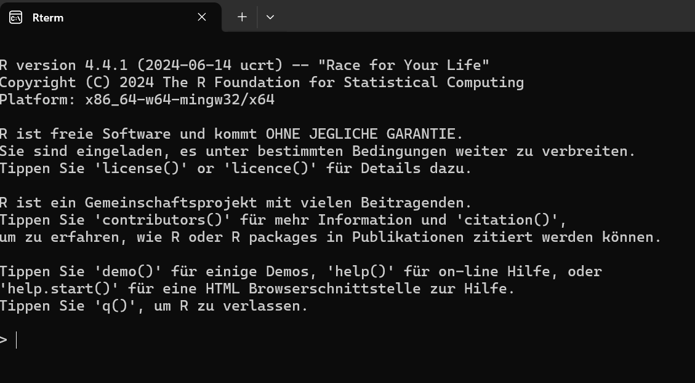
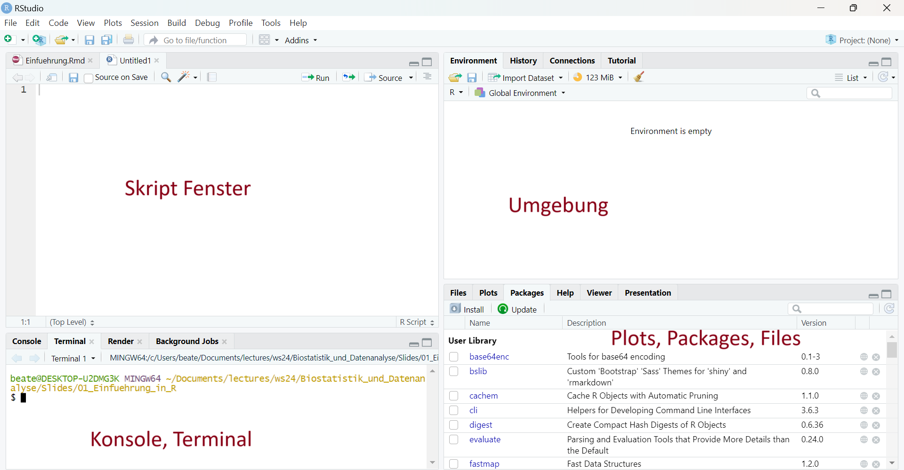
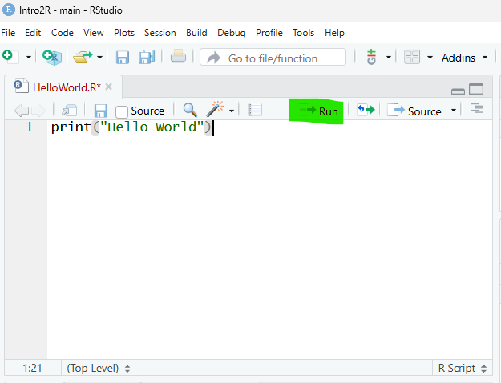

::: {.callout-tip title="Lernziele"}
Lernziele dieses Kapitels sind:

- R und RStudio erfolgreich zu installieren und erste Tests der Installation durchzuführen
- wesentliche Bereiche der RStudio-Oberfläche (Konsole, Editor, Environment/History, Plots/Help/Packages) zu identifizieren und zu nutzen
- zu wissen, wie man R-Pakete installiert und in einer Sitzung lädt
- gute Gewohnheiten für Workflow-Dokumentation und sauberen, lesbaren R-Code zu entwickeln
- R als interaktiven Taschenrechner zu verwenden und arithmetische Ausdrücke korrekt einzugeben
- die allgemeine Struktur eines Funktionsaufrufs (Funktionsname und Argumente) zu verstehen
- Hilfe zu Funktionen mit `?` oder `help()` aufzurufen und zu interpretieren
- einfache Berechnungen systematisch und reproduzierbar durchzuführen
:::

## Mit R starten

R ist eine Programmiersprache, die speziell für statistische Berechnungen, Datenanalyse und grafische Darstellungen entwickelt wurde. Sie verbindet eine leistungsfähige Rechenumgebung mit umfangreichen Möglichkeiten zur Visualisierung von Daten. Besonders in den Bereichen Statistik, Data Science und Forschung hat sich R als Standardwerkzeug etabliert.

Als interaktive Skriptsprache erlaubt R ein schrittweises Arbeiten mit Daten: Berechnungen können direkt ausgeführt, Ergebnisse sofort überprüft und Grafiken unmittelbar erzeugt werden. Die Programmierung folgt dabei überwiegend einem imperativen Ansatz, ähnlich wie bei Python. Es werden aber auch funktionale Konzepte aufgegriffen, was insbesondere bei komplexeren Analysen von Vorteil ist.

Ein weiterer Pluspunkt ist die Plattformunabhängigkeit. R läuft gleichermaßen unter Windows, macOS und Linux, sodass Projekte problemlos auf unterschiedlichen Systemen bearbeitet und geteilt werden können.

### R und RStudio installieren

Um mit R zu arbeiten, wird zunächst die Programmiersprache selbst installiert. Die jeweils aktuelle Version kann von der offiziellen Download-Seite bezogen werden.

R: <https://cloud.r-project.org>

Auf der R Webseite gibt es auch weitere Ressourcen zu R, zum Beispiel Manuals, einen Blog und Referenzen zu Büchern.

Ergänzend dazu empfiehlt sich die Installation von RStudio. RStudio ist eine grafische Oberfläche für R mit praktischen Zusatzfunktionen. R wird automatisch gestartet, wenn Sie RStudio starten.

RStudio: <https://www.rstudio.com>

### Aufruf und Bedienung

-   **Windows**: Öffnen Sie Ihren Ordner mit der R Installation, z.B. `C:\Program Files\R\R-4.4.1\bin` und klicken Sie auf R
-   **Linux**: Öffnen Sie ein Terminal, geben Sie den Befehl `R` und `Return` ein.

{#fig-r-konsole}

```         
Kommandoeingabe am Prompt `>`

Beispiel Eingabe: 
`> 1+2 <Return>`

Beispiel Ausgabe: 
`[1] 3`

Die letzten Kommandos abrufen und ändern mit den Cursor-Tasten → ↓ ↑ ←
```

### Das erste Programm in R

Für sehr kurze Rechnungen kann die direkte Eingabe von Befehlen in der R-Konsole ausreichend sein.\
In der praktischen Arbeit ist es jedoch sinnvoll, den geschriebenen Code dauerhaft zu speichern, um ihn später erneut ausführen, anpassen oder erweitern zu können.\
Hierzu werden sogenannte **Skripte** verwendet.

Skriptdateien für R-Programme besitzen üblicherweise die Dateiendung `.R`, zum Beispiel `HelloWorld.R`.

::: callout-note
## Konsole vs. Skript

-   Die **R-Konsole** eignet sich für kurze Tests und schnelle Rechnungen.\
-   **Skripte** ermöglichen es, Code strukturiert zu speichern, zu dokumentieren und wiederzuverwenden.\
-   Für längere Analysen und reproduzierbare Auswertungen sollte grundsätzlich mit Skripten gearbeitet werden.
:::

Grundsätzlich kann jeder beliebige Texteditor zum Schreiben von R-Skripten verwendet werden.\
Bequemer ist dies allerdings mit speziellen Entwicklungsumgebungen, den sogenannten IDEs. Wir nutzen das RStudio als IDE.

{#fig-rstudio}

Ein neues Skript lässt sich einfach über `File > New File > R Script` erstellen. Mit `Strg + S` kann gespeichert werden und ein sinnvoller Name für das Skript vergeben werden.

Geben Sie im Skript-Editor folgenden Code ein:

```{r echo=TRUE, eval=FALSE}
print("Hello, world")
```

Achten Sie darauf, den Code exakt so zu schreiben, einschließlich der Anführungszeichen und der Klammern, da diese für die korrekte Ausführung notwendig sind.

Im Gegensatz zu vielen anderen Programmiersprachen wird ein R-Skript nicht durch einen Doppelklick ausgeführt. R arbeitet als Interpreter, der den geschriebenen Code Schritt für Schritt ausführt.

Um das Programm auszuführen, können Sie den Code im Skript markieren und auf Ausführen (Run) klicken oder die entsprechende Tastenkombination verwenden (Windows/Linux: `Strg + Enter`).

{#fig-skript}
Im gezeigten Beispiel wird die Funktion `print()` verwendet. Ihr wird der Text `"Hello, world"` übergeben.  
Der Wert, der einer Funktion übergeben wird, heißt **Argument**. Funktionen verarbeiten ihre Argumente und führen daraufhin eine bestimmte Aktion aus.

In diesem Fall besteht die Wirkung der Funktion darin, dass der übergebene Text in der R-Konsole angezeigt wird.

### Zusatzpakete (Add-on Packages)

R ist ein erweiterbares System. Viele Anwenderinnen und Anwender stellen nützlichen Code, den sie entwickelt haben, in Form von Paketen zur Verfügung. Diese Pakete werden unter anderem über das **CRAN** (Comprehensive R Archive Network) oder über Plattformen wie **GitHub** verbreitet.

Um ein Paket aus CRAN zu installieren, kann im R-Konsolenfenster die Funktion `install.packages()` verwendet werden. Das folgende Beispiel zeigt die Installation des Pakets `dplyr`, das häufig zur Datenmanipulation eingesetzt wird:

```{r echo=TRUE, eval=FALSE}
install.packages("dplyr", dependencies = TRUE)
```

Durch das Argument `dependencies = TRUE` wird sichergestellt, dass zusätzlich alle weiteren Pakete installiert werden, von denen das Zielpaket abhängt.

Dies ist insbesondere für Einsteiger hilfreich, da fehlende Abhängigkeiten so automatisch berücksichtigt werden.

## R als Taschenrechner

Wir starten, indem wir die Programmiersprache R erst einmal als ganz normalen Taschenrechner benutzen.

### Kommentare in R mit `#`

-   Kommentare lassen sich mit Hilfe des Hash-Zeichens `#` einleiten
-   Alle Zeichen nach dem `#` werden von R ignoriert

```{r echo = TRUE}
5-1/2 # first calculate 1/2, then 5-0.5 = 4.5
```

Im Allgemeinen ist das Hinzufügen von Kommentaren zu Codes eine sehr gute Praxis, da es die Lesbarkeit erheblich verbessert und die Zusammenarbeit erleichtert.

### Einfache arithmetische Ausdrücke

R erlaubt die direkte Auswertung arithmetischer Ausdrücke, wie man sie aus der Mathematik kennt. Dazu gehören die grundlegenden Rechenoperatoren:

-   Addition `+`
-   Subtraktion `-`
-   Multiplikation `*`
-   Division `/`
-   Potenzen `^`
-   Klammern `()`

Diese Operatoren können beliebig kombiniert werden, um auch komplexere Ausdrücke zu berechnen. R wertet solche Ausdrücke sofort aus und gibt das numerische Ergebnis zurück.

**Beispiel**

```{r}
(1 + 2) / (4 - 1.2) * 2^10
```

Hier werden zunächst die Ausdrücke in Klammern berechnet, anschließend die Division durchgeführt und das Ergebnis mit einer Potenz multipliziert.

### Mathematische Funktionen

Neben arithmetischen Operatoren stellt R zahlreiche mathematische Funktionen zur Verfügung. Dazu gehören unter anderem:

-   `sin(x)` für den Sinus
-   `cos(x)` für den Kosinus
-   `log(x)` für den natürlichen Logarithmus
-   sowie viele weitere Funktionen

Mathematische Funktionen werden in R immer mit runden Klammern aufgerufen. Die Argumente der Funktion stehen dabei innerhalb der Klammern.

**Beispiel**

```{r}
log(10) / 2.5
```

In diesem Beispiel wird zunächst der natürliche Logarithmus von 10 berechnet.\
Das Ergebnis wird anschließend durch 2.5 dividiert.

::: callout-warning
### Achtung

In R bezeichnet `log(x)` standardmäßig den **natürlichen Logarithmus** (Basis (e)).\
Der Logarithmus zur Basis 10 muss explizit mit `log10(x)` berechnet werden.
:::

### Prioritäten von Operatoren

Wie in der Mathematik gelten auch in R feste Bindungsprioritäten für Operatoren. Besonders wichtig ist dabei die Regel „Punkt vor Strich“:

Multiplikation und Division haben eine höhere Priorität als Addition und Subtraktion.

**Beispiel**

```{r}
1 + 2 * 3
```

Dieser Ausdruck wird von R interpretiert als:

```{r}
1 + (2 * 3)
```

und **nicht** als:

```{r}
(1 + 2) * 3
```

### Operatoren und Operanden

Operatoren verknüpfen oder verändern **Operanden**, also Zahlen oder Ausdrücke. Man unterscheidet in R zwischen **binären** und **unären** Operatoren.

#### Binäre Operatoren

Binäre Operatoren stehen zwischen zwei Argumenten (A und B). Typische Beispiele sind:

-   `+`, `-`, `*`, `/`, `^`, `<-`

Binäre Operatoren können sich außerdem darin unterscheiden, **in welcher Richtung sie ausgewertet werden** (Assoziativität).

##### Linksassoziative Operatoren

Die meisten Operatoren sind **linksassoziativ**, das heißt, sie werden von links nach rechts ausgewertet. Dazu zählen:

-   `+`, `-`, `*`, `/`

**Beispiel**

```{r}
1 / 2 / 3
```

Dieser Ausdruck wird von R interpretiert als:

```{r}
(1 / 2) / 3
```

#### Rechtsassoziative Operatoren

Einige Operatoren sind **rechtsassoziativ**, insbesondere der Potenzoperator `^`.

##### Beispiel

```{r}
2^3^4
```

Dieser Ausdruck wird interpretiert als:

```{r}
2^(3^4)
```

und nicht als:

```{r}
(2^3)^4
```

#### Unäre Operatoren

Unäre Operatoren haben nur **ein einziges Argument**. Sie stehen dadurch entweder **vor** oder **nach** einem Ausdruck.

Ein typisches Beispiel ist der logische Negationsoperator `!`, der einen Wahrheitswert umkehrt.

**Beispiel**

```{r}
!TRUE
```

------------------------------------------------------------------------

::: callout-tip
## Merksätze

-   **Binäre Operatoren** verbinden zwei Operanden.
-   **Unäre Operatoren** arbeiten mit genau einem Operanden.
-   Die **Assoziativität** bestimmt, ob ein Ausdruck von links oder von rechts ausgewertet wird.
-   Im Zweifel sorgen **Klammern** für Klarheit.
:::

#### Operatoren als Funktionen

In R gibt es keinen grundlegenden Unterschied zwischen Operatoren und Funktionen. Jeder Operator ist intern eine Funktion und kann auch als solche aufgerufen werden.

Ein Operator wie `+` kann daher direkt als Funktion verwendet werden.\
Dabei gilt:

-   Der Operator muss in Backticks (`` ` ``) gesetzt werden
-   Die Argumente werden wie bei einem normalen Funktionsaufruf übergeben

**Beispiel**

``` r
# Verwendung als Operator
7 + 3

# Verwendung als Funktionsaufruf
`+`(7, 3)

# Beide Schreibweisen sind äquivalent
7 + 3 == `+`(7, 3)
```

::: callout-note
## Nice to know
Dieses Prinzip gilt nicht nur für `+`, sondern für alle Operatoren in R, zum Beispiel `-`, `*`, `/`, `==` und `<-`.
:::

#### Übersicht arithmetische und logische Operatoren

**Arithmetische Operatoren**

Arithmetische Operatoren werden in R zur Durchführung mathematischer Berechnungen mit numerischen Werten verwendet.

| Operatoren | Bedeutung                                          |
|------------|----------------------------------------------------|
| `+`, `-`   | Addition, Subtraktion                              |
| `*`, `/`   | Multiplikation, Division                           |
| `^`, `**`  | Potenz (*x* hoch *y*)                              |
| `x %/% y`  | Ganzzahlige Division (`5 %/% 2 == 2`)              |
| `x %% y`   | Modulo (x mod y) (`5 %% 2 == 1`)                   |
| `x %*% y`  | Matrixmultiplikation (`c(5, 3) %*% c(2, 4) == 22`) |

**Logische Operatoren**

Logische Operatoren dienen in R dazu, Werte zu vergleichen und logische Ausdrücke zu formulieren, die entweder `TRUE` oder `FALSE` ergeben.

| Operatoren | Bedeutung                      |
|------------|--------------------------------|
| `<`        | Kleiner                        |
| `<=`       | Kleiner gleich                 |
| `>`        | Grösser                        |
| `>=`       | Grösser gleich                 |
| `==`       | Gleich (testet auf Äquivalenz) |
| `!=`       | Ungleich                       |
| `!x`       | Nicht *x* (Verneinung)         |
| `x \| y`   | *x* ODER *y*                   |
| `x & y`    | *x* UND *y*                    |

### Einfache Kommandos in R

In diesem Abschnitt werden grundlegende Kommandos in R eingeführt. Sie lernen, wie Anweisungen im Interpreter ausgeführt werden und wie einfache Berechnungen mit Vektoren durchgeführt werden können.

#### Eingabe und Ausführung von Kommandos

R-Kommandos können direkt im Interpreter eingegeben und durch Drücken der **Enter- bzw. Return-Taste** ausgeführt werden. Das Ergebnis eines Kommandos wird unmittelbar angezeigt, sofern es nicht nur einer Zuweisung dient.

#### Arbeiten mit Vektoren

Eine der zentralen Datenstrukturen in R ist der **Vektor**.\
Vektoren werden mit der Funktion `c()` (combine) erzeugt.

Im folgenden Beispiel wird ein numerischer Vektor erstellt und in der Variablen `x` gespeichert:

```{r echo=TRUE, tidy=TRUE}
x <- c(1, 2, 5, 7)
```

Die Zuweisung erfolgt in R mit dem Operator `<-`.\
Dabei wird der Wert auf der rechten Seite einer Variablen auf der linken Seite zugewiesen.

Um den Inhalt einer Variablen auszugeben, genügt es, ihren Namen einzugeben:

```{r echo=TRUE, tidy=TRUE}
x
```

#### Mittelwert

Der Mittelwert eines Vektors kann mit der Funktion `mean()` berechnet werden.

```{r echo=TRUE, tidy=TRUE}
x <- c(1, 2, 5, 7)
mean(x)
```

#### Standardabweichung

Die Standardabweichung eines Vektors wird mit der Funktion `sd()` bestimmt.

```{r echo=TRUE, tidy=TRUE}
x <- c(1, 2, 5, 7)
sd(x)
```

#### Runden auf die nächstgelegene Zahl

Die Funktion `round()` rundet auf die nächstgelegene ganze Zahl.

```{r echo=TRUE, tidy=TRUE}
round(7/3)
```

Standardmäßig wird auf eine ganze Zahl gerundet. Im Beispiel ergibt sich für `7/3` der Wert 2. Die Genauigkeit der Rundung kann mit dem Argument `digits` gesteuert werden.

```{r echo=TRUE, tidy=TRUE}
round(7/3, digits=3)
```

Hier wird auf drei Dezimalstellen gerundet, was den Wert `2.333` ergibt.

#### Potenzen und Logarithmen

Potenzen und logarithmische Funktionen werden in R verwendet, um mit sehr großen oder sehr kleinen Zahlen sowie mit exponentiellem Wachstum zu arbeiten.

::: callout-note
## Wissenschaftliche Notation
Die wissenschaftliche Notation ist eine gebräuchliche Schreibweise für Zahlen, die zu groß oder zu klein sind, um sie komfortabel in Dezimalform darzustellen.\
Die e-Notation hat dabei keinen Bezug zur natürlichen Zahl ( e ).

\[ 100000 = 1 \times 10\^5 = 1\text{e}+05 \]

\[ 20000 = 2 \times 10\^4 = 2\text{e}+04 \]

\[ 0.0012 = 1.2 \times 10\^{-3} = 1.2\text{e}-03 \]
:::

In R können Potenzen mit dem Operator `^` berechnet werden.

```{r echo=TRUE, tidy=TRUE}
x <- 1 * 10^5
format(x, scientific = FALSE)
```

R stellt logarithmische Funktionen für verschiedene Basen bereit, wobei die gebräuchlichsten die Basis 10, die Basis 2 sowie die natürliche Basis ( e ) sind.

**Basis 10**

Der Logarithmus zur Basis 10 wird mit der Funktion `log10()` berechnet.\
Er gibt an, zu welcher Potenz die Zahl 10 erhoben werden muss, um einen bestimmten Wert zu erhalten.

```{r echo = TRUE}
10^6
```

```{r echo = TRUE}
#log10(x) = log(x, 10)
log10(1e6)  
```

Im Beispiel ergibt sich der Wert `6`, da `10^6=1000000`.

**Basis 2**

Der Logarithmus zur Basis 2 wird mit der Funktion `log2()` berechnet.

```{r echo = TRUE}
2^10
```

```{r echo = TRUE}
log2(1024)  #log2(x) = log(x, 2)
```

Hier ergibt sich der Wert `10`, da `2^10=1024`.

**Natürlicher Logarithmus von** $x$ zur Basis e

```{r echo = TRUE}
exp(1)
```

```{r echo = TRUE}
#log(x) = log(x,exp(1))
log(exp(1))  
```

## Hilfe in R

R verfügt über ein umfangreiches integriertes Hilfesystem, das es ermöglicht, Informationen zu Funktionen, Paketen und allgemeinen Themen direkt aus der Arbeitsumgebung heraus abzurufen.\
Gerade beim Lernen und bei der täglichen Arbeit ist dieses Hilfesystem eine zentrale Unterstützung.

### Hilfe zu einzelnen Kommandos

Um Hilfe zu einer bestimmten Funktion oder einem Kommando zu erhalten, kann der Funktionsname direkt abgefragt werden. Dies öffnet eine Hilfeseite mit Beschreibung, Argumenten, Rückgabewerten und Beispielen.

```{r echo=TRUE, eval=FALSE}
?mean
```

Alternativ kann die Funktion `help()` verwendet werden:

```{r echo=TRUE, eval=FALSE}
help("mean")
```

Beide Varianten sind äquivalent und liefern dieselbe Hilfeseite. Mit `help.search()` kann gezielt nach Stichwörtern gesucht werden. Dies ist besonders hilfreich, wenn der genaue Funktionsname nicht bekannt ist.

```{r echo=TRUE, eval=FALSE}
help.search("mean")
```

## Objekte, Funktionen und Zuweisungen

Wir haben sie im letzten Kapitel schon kennengelernt: Objekte, Funktionen und Zuweisungen. Jetzt wollen wir noch einmal etwas genauer auf diese Begriffe eingehen. Das Verständnis dieser Konzepte bildet die Grundlage für alle weiteren Schritte in R.

### Was ist ein R Objekt?

Um Berechnungen in R zu verstehen, sind zwei Leitsätze hilfreich:

> *Everything that exists is an object.*  
> *Everything that happens is a function call.*  
> — John Chambers
  
Objekte sind ein fundamentales Konzept in R. Tatsächlich gilt: **Alles ist ein Objekt** – Zahlen, Zeichenketten, Vektoren, Funktionen und sogar ganze Datensätze.

Jedes Objekt existiert im Arbeitsspeicher von R und kann dort weiterverwendet, verändert oder gelöscht werden.

### Funktionen in R

Funktionen sind vordefinierte oder selbst geschriebene **Algorithmen**, die einen oder mehrere **Eingabewerte (Input)** verarbeiten und daraus einen **Ausgabewert (Output)** erzeugen.

Ein einfaches Beispiel ist die Addition zweier Zahlen:

```{r echo=TRUE}
2 + 3
```

R gibt das Ergebnis `5` zwar direkt aus, es wird jedoch nicht gespeichert.
Nach der Berechnung ist das Resultat nicht mehr verfügbar.


### Variablen und Zuweisungen

Um Zwischenergebnisse oder ganze Datensätze weiterverwenden zu können, müssen sie in Variablen gespeichert werden. Der Vorgang, bei dem einem Objekt ein Name zugewiesen wird, heißt Zuweisung (engl. *assignment*).

Eine Möglichkeit ist die Verwendung der Funktion `assign()`:

```{r echo = TRUE}
  assign("ergebnis", 2+3)
  ergebnis
```
Häufiger wird jedoch der Zuweisungsoperator `<-` verwendet:

**Beispiele:**

```{r echo = TRUE}
  x <- 2
  y <- 3
  z <- x + y
```

Nach einer Zuweisung ist ein Symbol (z. B. `x`) mit einem konkreten Wert im Arbeitsspeicher von R verknüpft. Dieses Objekt kann anschließend in weiteren Berechnungen verwendet werden.

::: {.callout-note}
## Warum `<-` als Zuweisungsoperator?

Die Verwendung der Zeichenfolge `<-` als Zuweisungsoperator wirkt auf den ersten Blick ungewohnt, da in vielen Programmiersprachen stattdessen das Gleichheitszeichen `=` verwendet wird. Der Operator `<-` hat jedoch mehrere Vorteile. Er macht die Richtung der Zuweisung klar sichtbar: Ein Wert wird einem Namen zugewiesen, nicht umgekehrt.

Historisch stammt `<-` aus der Programmiersprache S, aus der R hervorgegangen ist. S wiederum übernahm diesen Operator aus der Sprache APL, für die es spezielle Tastaturen mit einer eigenen `<-`-Taste gab. Hinzu kommt, dass das Gleichheitszeichen `=` ursprünglich bereits für Vergleiche reserviert war. Zwar erlaubt R seit 2001 auch Zuweisungen mit `=`, dennoch gilt `<-` aufgrund der besseren Lesbarkeit und klareren Semantik weiterhin als empfohlener Standard.
:::


Quelle: [R für sozioökonomische Forschung](https://graebnerc.github.io/RforSocioEcon/basics.html#es:objekte)


### Zuweisungen

```{r echo = TRUE}
x <- c(1,2,3)
```

-   Ein Objekt wird erstellt, nämlich `c(1,2,3)`
-   Das Objekt wird einem Namen zugewiesen, $x$

{#fig-r-konsole}

### Benennung von Variablen

Beim Arbeiten mit R ist eine korrekte und sinnvolle Benennung von Variablen besonders wichtig.  
Variablennamen dienen dazu, Objekte im Arbeitsspeicher eindeutig zu identifizieren und später wiederzuverwenden.

#### Groß- und Kleinschreibung

R unterscheidet strikt zwischen Groß- und Kleinschreibung. Das bedeutet, dass unterschiedliche Schreibweisen auch unterschiedliche Variablen bezeichnen:

- `x1` und `X1` sind zwei verschiedene Variablen
- Gleiches gilt für Funktionsnamen

#### Erlaubte Zeichen

Variablennamen dürfen ausschließlich bestehen aus:

- Buchstaben (`a`–`z`, `A`–`Z`)
- Zahlen (`0`–`9`)
- den Sonderzeichen `.` (Punkt) und `_` (Unterstrich)

Dabei gelten folgende Regeln:

- Variablennamen **dürfen nicht mit einer Zahl beginnen**
- Variablennamen **dürfen nicht mit einem Punkt `.` beginnen**

Beispiele für gültige Variablennamen sind:

- `x1`
- `X1`
- `min.dist`
- `Best.gene`

#### Ungültige Namen und Fehlermeldungen

Bestimmte Bezeichnungen sind in R **reserviert** und dürfen nicht als Variablennamen verwendet werden.  
Dazu gehören unter anderem logische Konstanten wie `TRUE` und `FALSE`.

Wird dennoch versucht, einer solchen Bezeichnung einen Wert zuzuweisen, gibt R eine Fehlermeldung aus:
    ```         
    TRUE <- 5   # Signalwort, welches nicht verwendet werden darf
    #> Error in TRUE <- 5: invalid (do_set) left-hand side to assignment
    ```
       
Diese Fehlermeldung weist darauf hin, dass die linke Seite der Zuweisung ungültig ist.

Alle aktuell im Arbeitsspeicher vorhandenen Objekte werden in RStudio im Bereich Environment angezeigt. Zusätzlich kann die Funktion `ls()` verwendet werden, um alle aktuellen Namenszuweisungen in der Konsole auszugeben:

{#fig-r-variable}

::: {.callout-tip}
## Gute Variablennamen

- Verwenden Sie sprechende Namen, die den Inhalt beschreiben (z. B. alter, gewicht_kg).
- Vermeiden Sie sehr kurze oder nichtssagende Namen wie x oder tmp, außer bei kurzen Beispielen.
- Bleiben Sie bei einer einheitlichen Schreibweise (z. B. Unterstriche oder Punkte).
- Nutzen Sie keine reservierten Wörter oder Funktionsnamen als Variablennamen.
- Gut gewählte Namen verbessern die Lesbarkeit und Wartbarkeit von Code erheblich.
:::

## Funktionen

Funktionen sind ein zentrales Konzept in R. Sie können als **Blackboxen** verstanden werden: Eine Funktion erhält einen oder mehrere Eingabewerte, verarbeitet diese intern und liefert anschließend ein Ergebnis zurück.

Symbolisch lässt sich eine Funktion als $f(x, y, z)$ darstellen. Dabei lassen sich drei zentrale Aspekte unterscheiden:

- **Eingang (Input):**  
  Die Eingabewerte einer Funktion werden als **Parameter** oder **Argumente** bezeichnet. Einige dieser Parameter können mit **Standardwerten** vorbelegt sein.

- **Ausgang (Output):**  
Das Ergebnis einer Funktion ist immer ein **R-Objekt**, zum Beispiel eine Zahl, ein Vektor oder ein komplexerer Datentyp.

- **Seiteneffekte:**  
Zusätzlich zum eigentlichen Rückgabewert kann eine Funktion weitere Effekte haben, etwa:
  - Textausgaben in der Konsole  
  - das Erzeugen von Dateien  
  - das Öffnen von Grafik- oder Hilfefenstern  

{#fig-r-function}

### Funktionsaufrufe

Funktionen können unbenannte oder benannte Parameter akzeptieren:

-   Benannte Parameter besitzen Standard-Werte

```{r echo = TRUE,tidy = TRUE}
x <- c(1,NA,6)
mean(x)
```

-   Benannte Parameter müssen mit "=" abgetrennt werden

```{r echo = TRUE,tidy = TRUE}
x <- c(1,NA,6)
mean(x,na.rm=TRUE)
```

### Wichtige Basis-Funktionen

| Funktionen                 | Bedeutung                                    |
|----------------------------|--------------------------------------------|
| `log()`, `exp()`           | Natürlicher Logarithmus, Exponentialfunktion |
| `sin()`, `cos()`, `tan()`  | Trigonometrische Funktionen                  |
| `sqrt()`, `abs()`          | Wurzel, Absolutwert                          |
| `sum()`, `cumsum()`        | Summe, kumulative Summe                      |
| `prod()`, `diff()`         | Produkt, Differenzen                         |
| `mean()`, `var()`          | Mittelwert, Varianz                          |
| `max()`, `min()`           | Maximalwert, Minimalwert                     |
| `which.min()`, `which.max` | Index des Maximal-/Minimalwertes             |
| `which()`                  | Indizes, deren Elemente TRUE sind            |
| `sort()`,`order()`         | Sortiere Vektor, Ordnung des Vektors         |
| `rank()`                   | Rangzuweisung                                |

### Funktionen in der beschreibenden Statistik

| Funktionen   | Bedeutung                                               |
|--------------|---------------------------------------------------------|
| `mean()`     | Mittelwert                                              |
| `median()`   | Median                                                  |
| `var()`      | Varianz                                                 |
| `sd()`       | Standard-Abweichung                                     |
| `min()`      | Minimum                                                 |
| `max()`      | Maximum                                                 |
| `range()`    | Wertebereich                                            |
| `IQR()`      | Interquartilbereich                                     |
| `quantile()` | Quantile                                                |
| `table()`    | Häufigkeitstabelle                                      |
| `summary()`  | Min, max, mean, median und das erste und dritte Quartil |


### Eigene Funktionen definieren 

- Reserviertes Schlüsselwort: `function`
- Beispiel: Bestimmung der Länge der Hypothenuse über Satz des Pythagoras

```{r echo = TRUE,tidy = TRUE}
# Definition der Funktion
pythagoras <- function(kathete_1, kathete_2){
  hypo_quadrat <- kathete_1**2 + kathete_2**2
  hypothenuse <- sqrt(hypo_quadrat) # sqrt() zieht die Quadratwurzel
  return(hypothenuse)
}

# Aufruf der Funktion
pythagoras(2, 4)
```


### Einfache Datentypen

R stellt verschiedene Datentypen zur Verfügung, um unterschiedliche Arten von Informationen darzustellen. Grundsätzlich unterscheidet man zwischen einfachen und zusammengesetzten Datentypen.

Zu den einfachen Datentypen gehören:

- `logical` – logische Werte  
- `integer` – ganze Zahlen  
- `double` – Fließkommazahlen  
- `character` – Zeichenketten  
- `factor` – kategoriale Daten  

Daneben existieren zusammengesetzte Datentypen, die mehrere Werte oder Strukturen enthalten können, zum Beispiel:

- `vector`, `list`
- `matrix`, `array`
- `data.frame`
- `function`

**Beispiele für einfache Datentypen**

Die wichtigsten einfachen Datentypen lassen sich wie folgt illustrieren:

- **Logische Werte:** `TRUE`, `FALSE`  
- **Ganzzahlen (Integer):** `42`, `-15`  
- **Fließkommazahlen (Double):** `0.3`, `1.25e-12`  
- **Zeichenketten (Character):** `"this is my string"`

```{r echo=TRUE}
iamhappy <- TRUE
mynumber <- 4
n2 <- 0.3
hello <- "world"
```

::: {.callout-note}
## Dynamische Typisierung

R ist eine dynamisch typisierte Programmiersprache. Das bedeutet, dass beim Programmieren nicht explizit angegeben werden muss, welchen Datentyp eine Variable besitzt. Der Datentyp ergibt sich automatisch aus dem zugewiesenen Wert.
:::

#### Fließkommazahlen

Fließkommazahlen werden in R als double gespeichert. Aufgrund der internen Darstellung können dabei Rundungsfehler auftreten.

```{r echo = TRUE}
sqrt(2)
```

```{r echo = TRUE}
sqrt(2)^2
```

Auf den ersten Blick scheint das Ergebnis exakt zu sein.
Ein direkter Vergleich mit `==` liefert jedoch ein überraschendes Resultat:
```{r echo = TRUE}
sqrt(2) == 2
```

Zum Nachlesen: <https://r-intro.tadaa-data.de/datentypen>

Fließkommazahlen sollten nicht direkt mit `==` verglichen werden. Stattdessen empfiehlt sich ein Vergleich mit einer kleinen Toleranz.

```{r echo = TRUE}
  x <- 1.1 - 0.2
  y <- 0.9
  eps <- 0.000000001
  print(abs(x - y) < eps)
```

Hier wird geprüft, ob sich die beiden Werte nur um einen sehr kleinen Betrag unterscheiden.

#### Besondere Konstanten in R

R kennt mehrere spezielle Konstanten, die in der Datenanalyse häufig auftreten:

- `NA`: not available (Fehlender Wert)

- `Inf`, `-Inf`: Unendlich (double)
```{r echo = TRUE}
10^1000
```
  
- `NaN`: *not a number*
```{r echo = TRUE}
0/0
```

### Logische Werte

Logische Ausdrücke werden in R verwendet, um Bedingungen zu formulieren und Entscheidungen zu treffen. Die grundlegenden logischen Operatoren sind:

 `|` (oder), `&` (und), `!` (nicht).

Das folgende Beispiel zeigt einfache logische Verknüpfungen mit logischen Variablen:

```{r echo = TRUE}
  itsRaining <- TRUE
  SprinklerOn <- FALSE

  I.get.wet <- itsRaining | SprinklerOn
  dry <- (!itsRaining) & (!SprinklerOn)
```

Für logische Vektoren stellt R spezielle Funktionen bereit, um Aussagen über alle oder einzelne Elemente zu treffen:
-   `all()`: Alle Elemente sind wahr.
-   `any()`: Es existiert ein Element, das wahr ist.

::: {.callout-warning}
## Typische Fehler bei logischen Vergleichen in R

**Verwendung von `=` statt `==`**  
Der Operator `=` dient der Zuweisung, während `==` für den Vergleich auf Gleichheit verwendet wird.

**Direkter Vergleich von Fließkommazahlen**  
Aufgrund von Rundungsfehlern sollten numerische Werte nicht direkt mit `==` verglichen werden. Verwenden Sie stattdessen einen Vergleich mit Toleranz, z. B. `abs(x - y) < eps`.

**Unbeachtete fehlende Werte (`NA`)**  
Logische Ausdrücke mit `NA` liefern oft ebenfalls `NA`. Vor logischen Vergleichen sollten fehlende Werte geprüft oder behandelt werden.

**Verwendung von `==` statt `all()` oder `any()` bei Vektoren**  
Der Vergleich eines logischen Vektors mit `TRUE` oder `FALSE` ist meist nicht sinnvoll. Nutzen Sie `all()` oder `any()`, um Aussagen über mehrere Werte zu treffen.
:::

### Tests und Umwandlungen

R stellt Funktionen zur Überprüfung und Umwandlung von Datentypen bereit, darunter:
- `is.na()` – prüft, ob ein Wert fehlt (NA)
- `is.numeric()` - prüft, ob ein Objekt numerisch ist
- `as.integer()` - wandelt einen Wert in einen Integer um


## Verständnisfragen

::: callout-question

1.  Wofür eignet sich die Arbeit in der R-Konsole, und wann ist es sinnvoller, ein Skript zu verwenden?
2.  Welche Aufgabe hat der Zuweisungsoperator `<-` in R, und wie wird er verwendet?\
3.  Was ist in R der Unterschied zwischen einem **Operator** und einem **Operanden**? Nennen Sie ein Beispiel.\
4.  Was ist ein Vektor in R, und wie kann ein numerischer Vektor erzeugt werden?\
5.  Worin unterscheiden sich die Funktionen `floor()`, `ceiling()` und `round()` voneinander?\
6.  Wie beeinflusst das Argument `digits` das Ergebnis der Funktion `round()`?
7.  Wie werden Potenzen in R berechnet, und welcher Operator wird dafür verwendet?\
8.  Welche logarithmischen Funktionen stellt R zur Verfügung, und für welche Basen werden sie eingesetzt?\
9.  Was versteht man unter wissenschaftlicher Notation, und warum ist sie im Umgang mit großen oder kleinen Zahlen hilfreich?\
10. Wie kann das integrierte Hilfesystem von R genutzt werden, wenn der Name einer Funktion bekannt ist oder unbekannt ist?
:::

## Übungen

**Übung 1**

Berechnen Sie:

1.  $\frac{1}{2} \cdot \frac{1+2+3+4}{2+4+6}$
2.  $e$
3.  $\sqrt{2}$
4.  $\sqrt[3]{8}$
5.  $log_2(8)$

**Übung 2**

1.  Wie erhalten Sie Hilfe zu der Funktion `floor`?
2.  Berechnen Sie das Quadrat von $\pi$ und runden Sie auf 4 Ziffern nach dem Dezimalpunkt
3.  Berechnen Sie den Logarithmus von 1 Milliarde mit Basis 1000.

**Übung 3**

Der **Body-Mass-Index (BMI)** ist eine häufig verwendete Kennzahl zur Bewertung des Körpergewichts in Relation zur Körpergröße.  
Er wird nach folgender Formel berechnet:

$$
\text{BMI} = \frac{\text{Körpergewicht (kg)}}{\text{Körpergröße (m)}^2}
$$

1. Legen Sie eine neue R-Skriptdatei mit dem Namen `bmi.R` an.  
2. Definieren Sie in diesem Skript zwei Variablen:
   - `gewicht` für das Körpergewicht in Kilogramm  
   - `groesse` für die Körpergröße in Metern  
3. Berechnen Sie den BMI mithilfe der oben angegebenen Formel.  
4. Geben Sie den berechneten BMI in der R-Konsole aus.  
5. Runden Sie den BMI auf **eine Dezimalstelle**.