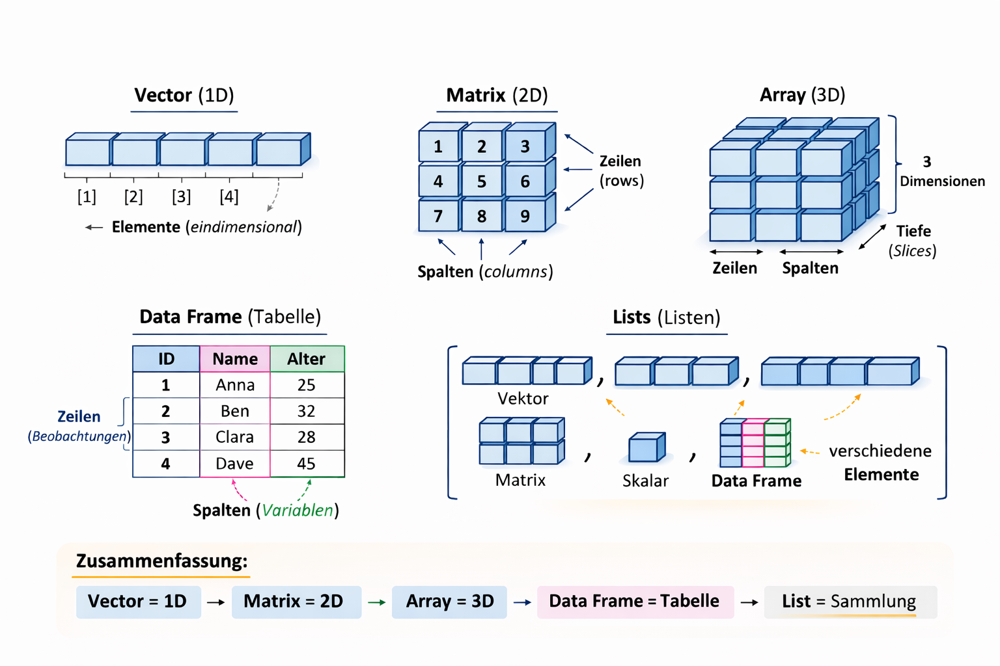

::: {.callout-tip title="Lernziele"}
Lernziele dieses Kapitels sind:

- die grundlegenden Datenstrukturen in R (Vektoren, Matrizen, Arrays, Listen, Data Frames und Factors) zu verstehen und zu unterscheiden,
- Vektoren mit `c()`, `seq()` und `rep()` zu erzeugen und typische Operationen anzuwenden,
- verschiedene Formen der Indizierung sicher einzusetzen,
- Matrizen, Listen und Data Frames zu erstellen und deren Elemente gezielt anzusprechen,
- Datensätze einzulesen und ihre Struktur zu untersuchen,
- Factors zu interpretieren und Levels gezielt festzulegen.
:::

Ein Überblick über die wichtigsten Strukturen zeigt Abbildung
@fig-datastructure.

::: {#fig-datastructure}


Datenstrukturen in R, generiert mit ChatGPT, angelehnt an
[R for Biologists](https://bioinformatics-core-shared-training.github.io/Bitesize-R/week2.html)
:::

## Vektoren

### Übersicht

{#fig-vektor}
Vektoren sind die zentrale Datenstruktur in R, da viele Funktionen
automatisch elementweise auf Vektoren arbeiten.

Man unterscheidet zwei wichtige Typen:

-   **Atomare Vektoren** enthalten Elemente des gleichen Datentyps
    (z. B. nur Zahlen, nur Zeichenketten oder nur logische Werte).
-   **Listen** können Elemente unterschiedlicher Datentypen
    enthalten, z. B. Zahlen, Zeichenketten oder sogar andere Vektoren.

{#fig-vektorlist}

### Erzeugen von Vektoren

Es gibt verschiedene Möglichkeiten, Vektoren in R zu erzeugen.

Mit `c()` (combine): Mit der Funktion `c()` können mehrere Werte zu
einem Vektor zusammengefasst werden.

```{r echo = TRUE}
c(1,1.5,2)
```

Hier wird ein numerischer Vektor mit drei Elementen erzeugt.

Mit `double()`: Die Funktion `double(n)` erzeugt einen numerischen
Vektor der Länge $n$, dessen Elemente zunächst alle den Wert 0 haben.

```{r echo = TRUE}
double(5)
```

Dies ist z. B. nützlich, wenn man einen Vektor vorab reservieren möchte.

Mit dem Sequenzoperator `:`: Mit `:` kann man eine einfache Folge von
ganzen Zahlen erzeugen.

```{r echo = TRUE}
1:5
```

Mit `rep()`: Die Funktion `rep()` wiederholt einen Wert oder einen
Vektor eine bestimmte Anzahl von Malen.

```{r echo = TRUE}
rep(3,5)
```

Hier wird die Zahl 3 fünfmal wiederholt.

Mit `seq()`: Mit `seq()` kann man allgemeinere Zahlenfolgen erzeugen.

```{r echo = TRUE}
seq(0,0.6, 0.2)
```

Hier beginnt die Folge bei 0, endet bei 0.6 und erhöht sich jeweils um
0.2.

### Indizierung

Mit Hilfe von Indizes kann man auf einzelne Elemente eines Vektors
zugreifen. In R beginnt die Zählung bei 1 (nicht bei 0 wie in manchen
anderen Programmiersprachen).

Für einen Vektor `x` mit der Länge `length(x)` sind daher die gültigen
Indizes `1...length(x)`. Der Zugriff auf Elemente erfolgt mit eckigen
Klammern.

```{r echo = TRUE,tidy = TRUE}
x <- c(1.7, 3.8, 4.2, 5.7)
x[2] # zweites Element 
x[2:3] # Elemente 2 bis 3
x[c(4,4,1)] # Auswahl mehrerer Positionen (auch mehrfach möglich)
x[-c(1,2)] # entferne Elemente an Position 1 und 2
```

::: callout-note
## Merksatz zur Indizierung

-   `x[i]` → einzelnes Element\
-   `x[i:j]` → zusammenhängender Bereich\
-   `x[c(...)]` → beliebige Auswahl\
-   `x[-i]` → Ausschluss von Positionen
:::

### Logische Indizierung

In R können Vektoren nicht nur über numerische Positionen, sondern auch
über logische Werte (`TRUE` und `FALSE`) indiziert werden. Dabei
bestimmt jeder logische Wert, ob ein Element ausgewählt wird oder nicht.

-   `TRUE` → Element wird ausgewählt\
-   `FALSE` → Element wird nicht ausgewählt

Der logische Vektor muss dabei die gleiche Länge wie der Vektor haben,
auf den er angewendet wird.

**Beispiel**

``` r
x <- c(1.7, 0.5, -0.7, 0, 2.8, 0.2)
x[c(TRUE, TRUE, FALSE, FALSE, TRUE, TRUE)]
```

Der logische Indexvektor entscheidet, welche Werte aus `x` übernommen
werden.

| Position | Wert in `x` | Logischer Wert | Ergebnis        |
|----------|-------------|----------------|-----------------|
| 1        | 1.7         | TRUE           | wird übernommen |
| 2        | 0.5         | TRUE           | wird übernommen |
| 3        | -0.7        | FALSE          | wird ignoriert  |
| 4        | 0           | FALSE          | wird ignoriert  |
| 5        | 2.8         | TRUE           | wird übernommen |
| 6        | 0.2         | TRUE           | wird übernommen |

Das Ergebnis lautet:

``` r
[1] 1.7 0.5 2.8 0.2
```

**Merksatz**

> **Ein logischer Vektor wirkt wie ein Filter:**\
> `TRUE` lässt ein Element passieren, `FALSE` entfernt es.

#### Filtern von Vektoren mit Bedingungen

Eine sehr häufige Anwendung der logischen Indizierung ist das Filtern
von Vektoren anhand von Bedingungen. Dabei wird eine Bedingung auf jedes
Element eines Vektors angewendet. Das Ergebnis ist ein **logischer
Vektor**, der anschließend als Index verwendet werden kann.

**Beispiel**

``` r
x <- c(0.3, 0.1, 5.7, -1.0)
y <- c(2, 3, 1, 5)

x > 0
```

Der Ausdruck `x > 0` überprüft für jedes Element von `x`, ob es größer
als 0 ist.\
Das Ergebnis ist ein logischer Vektor:

``` r
[1] TRUE TRUE TRUE FALSE
```

Dieser logische Vektor kann direkt als Index verwendet werden:

``` r
x[x > 0]
```

Ergebnis:

``` r
[1] 0.3 0.1 5.7
```

Alle Werte von `x`, die größer als 0 sind, werden ausgewählt.

------------------------------------------------------------------------

**Merksatz**

> Eine Bedingung erzeugt einen logischen Vektor, der direkt zum Filtern
> eines Vektors verwendet werden kann.

------------------------------------------------------------------------

#### Positionen mit `which()`

Manchmal interessiert nicht der Wert selbst, sondern **an welcher
Position im Vektor** sich ein Element befindet, das eine bestimmte
Bedingung erfüllt. Dafür gibt es die Funktion `which()`.

**Beispiel**

``` r
which(x > 0)
```

Ergebnis:

``` r
[1] 1 2 3
```

Das bedeutet: Die ersten drei Elemente von `x` sind größer als 0.

------------------------------------------------------------------------

**Merksatz**

> `which()` gibt die Positionen der Elemente zurück, die eine Bedingung
> erfüllen.

------------------------------------------------------------------------

#### Konkatenierung von Vektoren

Mit der Funktion `c()` (combine) können mehrere Vektoren zu einem neuen
Vektor zusammengefügt werden.

**Beispiel**

``` r
c(x, y)
```

Ergebnis:

``` r
[1] 0.3 0.1 5.7 -1.0 2 3 1 5
```

Die Elemente des zweiten Vektors werden dabei einfach an den ersten
Vektor angehängt.

------------------------------------------------------------------------

**Merksatz**

> Mit `c()` können mehrere Werte oder Vektoren zu einem neuen Vektor
> kombiniert werden.

------------------------------------------------------------------------

### Skalare Operationen

**Skalare** Operationen werden für jedes Element einzeln durchgeführt.

```{r echo = TRUE}
x <- c(1,1.5,2)
x+2
```

```{r echo = TRUE}
x-2
```

```{r echo = TRUE}
x*2
```

```{r echo = TRUE}
x/2
```

### Arithmetik mit Vektoren

In R können **arithmetische Operationen direkt auf Vektoren** angewendet
werden.\
Dabei werden die Operationen **elementweise** ausgeführt. Das bedeutet,
dass die entsprechenden Elemente zweier Vektoren miteinander verrechnet
werden.

#### Arithmetik auf Vektoren gleicher Länge

Wenn zwei Vektoren **dieselbe Länge** besitzen, werden ihre Elemente
paarweise kombiniert.

**Beispiel: Addition**

```{r echo=TRUE}
c(1,2,3) + c(1.2,-0.5,-0.1)
```

**Beispiel: Subtraktion**

```{r echo=TRUE}
c(1,2,3) - c(1.2,-0.5,-0.1)
```

**Beispiel: Multiplikation**

```{r echo=TRUE}
c(1,2,3) * c(1.2,-0.5,-0.1)
```

**Beispiel: Division**

```{r echo=TRUE}
c(1,2,3) / c(1.2,-0.5,-0.1)
```

**Merksatz**

> Arithmetische Operationen auf Vektoren werden elementweise ausgeführt.

------------------------------------------------------------------------

### Arithmetik mit Vektoren unterschiedlicher Länge (Recycling)

Sind die Vektoren unterschiedlich lang, verwendet R das sogenannte
**Recycling-Prinzip**.\
Dabei wird der kürzere Vektor wiederholt, bis er die Länge des längeren
Vektors erreicht.

**Beispiel**

```{r echo=TRUE}
c(1,1,1,1,1) * c(1,2,3)
```

Intern interpretiert R dies als:

```{r echo=TRUE}
c(1,1,1,1,1) * c(1,2,3,1,2)
```

**Merksatz**

> Ist ein Vektor kürzer, wird er in R automatisch wiederholt
> (Recycling).

------------------------------------------------------------------------

### Funktionen auf Vektoren

Viele mathematische Funktionen können sowohl mit **einzelnen Zahlen
(Skalaren)** als auch mit **Vektoren** arbeiten.

#### Skalare Funktionen auf Vektoren

Eine skalare Funktion hat mathematisch die Form

$$f:\mathbb{R} \rightarrow \mathbb{R}$$

Sie wird auf jedes Element eines Vektors einzeln angewendet.

**Beispiel: Eingabe eines Skalars**

``` r
exp(1)
```

**Beispiel: Eingabe eines Vektors**

``` r
exp(c(0,1,2,3))
```

Das Ergebnis enthält die Exponentialfunktion für jedes einzelne Element.

**Merksatz**

> Viele Funktionen in R arbeiten automatisch elementweise auf Vektoren.

------------------------------------------------------------------------

#### Vektorwertige Eingaben

Einige Funktionen erwarten **Vektoren als Argumente** und berechnen
daraus einen einzelnen Wert.

Mathematisch entspricht dies Funktionen der Form

$$f:\mathbb{R}^n \rightarrow \mathbb{R}$$

**Beispiel: Mittelwert**

```{r echo=TRUE}
mean(c(1.2,-0.5,-0.1))
```

Der Mittelwert fasst mehrere Werte zu einer einzelnen Kennzahl zusammen.

------------------------------------------------------------------------

**Beispiel: Korrelation**

```{r echo=TRUE}
cor(c(1.2,-0.5,-0.1), c(2.2,0.5,0.9))
```

Die Funktion `cor()` berechnet die Korrelation zwischen zwei Vektoren,
also ein Maß für den linearen Zusammenhang zwischen zwei Variablen.

------------------------------------------------------------------------

**Beispiel: Skalarprodukt**

```{r echo=TRUE}
c(1,2,3) %*% c(1.2,-0.5,-0.1)
```

Das Skalarprodukt multipliziert die entsprechenden Elemente und summiert
anschließend die Ergebnisse.

**Merksatz**

> Einige Funktionen verarbeiten ganze Vektoren und geben eine einzelne
> Kennzahl zurück.

------------------------------------------------------------------------

#### Länge eines Vektors bestimmen

``` r
a <- c(1,2,3)
length(a)
```

Die Funktion `length()` gibt die Anzahl der Elemente eines Vektors
zurück.

### Wichtige Funktionen für Vektoren

| Operator/Funktion | Bedeutung                               |
|-------------------|-----------------------------------------|
| `1:5`             | erzeugt den Vektor `1 2 3 4 5`          |
| `seq(from,to,by)` | erzeugt eine lineare Sequenz von Werten |
| `rep(0.3,4)`      | wiederholt einen Wert mehrfach          |
| `c(1,3,9)`        | erzeugt einen Vektor                    |
|                   | kombiniert mehrere Werte oder Vektoren  |
| `logical(n)`      | logischer Vektor der Länge `n`          |
| `integer(n)`      | Ganzzahlvektor der Länge `n`            |
| `double(n)`       | numerischer Vektor der Länge `n`        |
| `character(n)`    | Zeichenkettenvektor der Länge `n`       |
| `length(v)`       | Länge eines Vektors                     |
| `names(v)`        | Namen der Vektorelemente                |

------------------------------------------------------------------------

## Matrizen

### Was ist eine Matrix?

Eine Matrix ist ein zweidimensionaler Container, der aus Zeilen und
Spalten besteht.

Wichtige Eigenschaften:

-   eine Matrix hat die Dimension Zeilen × Spalten
-   alle Elemente besitzen denselben Datentyp
-   häufig verwendete Datentypen sind numeric, integer oder character

Matrizen werden in R häufig für numerische Berechnungen, lineare Algebra
und statistische Analysen verwendet.

### Matrix erzeugen

Eine Matrix wird mit der Funktion `matrix()` erzeugt.

```{r echo=TRUE }
x <- matrix(1:6, nrow = 2, ncol = 3)
print(x)
```

Was passiert hier:

-   1:6 erzeugt einen Vektor mit den Zahlen 1 bis 6
-   nrow = 2 legt die Anzahl der Zeilen fest
-   ncol = 3 legt die Anzahl der Spalten fest

R füllt Matrizen standardmäßig spaltenweise.

### Indizierung von Matrizen

Der Zugriff auf einzelne Elemente oder Teilbereiche einer Matrix erfolgt
in R über Indizierung. Dabei wird die allgemeine Syntax

```         
x[Zeile, Spalte]
```

verwendet. Der erste Index gibt die Zeile, der zweite Index die Spalte
an. Auf diese Weise lassen sich einzelne Werte, ganze Zeilen, ganze
Spalten oder auch mehrere Spalten gleichzeitig auswählen.

Im folgenden Beispiel wird eine bereits definierte Matrix `x` verwendet.

```{r echo = TRUE,tidy = TRUE}
# Zugriff auf ein einzelnes Element
print(x[1,3])
# Zugriff auf eine ganze Zeile
print(x[2,])
# Zugriff auf eine ganze Spalte
print(x[,2])
# Zugriff auf mehrere Spalten
print(x[,1:2])
x <- matrix(1:6, nrow=2, ncol=3)
print(x)
# Ganze Zeile als Matrix
print(x[2,,drop=FALSE])
# Ganze Spalte als Matrix
print(x[,2,drop=FALSE])
```

Der Ausdruck `x[2,,drop=FALSE]` gibt die zweite Zeile der Matrix zurück.
Durch `drop = FALSE` bleibt das Ergebnis eine 1×3-Matrix.

Analog liefert `x[,2,drop=FALSE]` die zweite Spalte der Matrix als
2×1-Matrix.

Die Verwendung von `drop = FALSE` ist besonders hilfreich, wenn
nachfolgende Berechnungen eine Matrixstruktur voraussetzen und nicht mit
einem Vektor arbeiten sollen.

### Lineare Indizierung

Neben der zweidimensionalen Indizierung über Zeilen und Spalten
unterstützt R auch eine lineare Indizierung von Matrizen. Dabei wird die
Matrix intern als Vektor betrachtet. Die Elemente werden standardmäßig
spaltenweise angeordnet.

Das bedeutet, dass zuerst alle Elemente der ersten Spalte, danach die
der zweiten Spalte und anschließend die der weiteren Spalten
berücksichtigt werden.

Im folgenden Beispiel wird zunächst eine Matrix erzeugt und anschließend
verschiedene Formen der linearen Indizierung demonstriert.

```{r echo = TRUE,tidy = TRUE}
x <- matrix(1:6, nrow=2, ncol=3)
print(x)
print(x[x<3])
print(x[1])
```

### Zeilen und Spaltennamen

Zeilen und Spalten können benannt werden: - `colnames()` - `rownames()`

```{r echo = TRUE,tidy = TRUE}
colnames(x) <- c("C1", "C2", "C3")
rownames(x) <- c("R1", "R2")
print(x)
```

### Matrizen – Wichtige Funktionen

| *Funktion*                  | *Bedeutung*                          |
|-----------------------------|--------------------------------------|
| `matrix()`                  | Matrix erzeugen                      |
| `dim()`, `ncol()`, `nrow()` | Anzahl Zeilen und Spalten            |
| `t()`                       | Transponieren einer Matrix           |
| `x[i]`                      | Spaltenweise Vektorisierung          |
| `%*%`                       | Matrixmultiplikation                 |
| `solve()`                   | Matrixinverse/Lösung von lin.gl.Sys. |
| `diag()`                    | Hauptdiagonale der Matrix            |

## Listen

Listen sind ein flexibler Datentyp in R. Sie können Elemente
unterschiedlicher Typen enthalten, z. B. Zeichenketten, Vektoren oder
Matrizen.

### Erstellen einer Liste

Eine Liste wird mit der Funktion `list()` erzeugt:

```{r echo = TRUE,tidy = TRUE}
L <- list("hallo", c(1, 3, 7), matrix(1:6, 3))
print(L)
```

Die Liste `L` enthält hier drei Elemente:

-   eine Zeichenkette (`"hallo"`)
-   einen numerischen Vektor (`c(1, 3, 7)`)
-   eine Matrix (`matrix(1:6, 3)`)

Auf einzelne Elemente kann man über **Indizes** zugreifen.

::: callout-tip
## Merke: Zugriff auf Listenelemente

In R gibt es drei Möglichkeiten, auf Elemente einer Liste zuzugreifen:

-   `L[i]`\
    Gibt eine Teilliste zurück.

-   `L[[i]]`\
    Gibt das eigentliche Element der Liste zurück.

-   `L$name`\
    Greift auf ein benanntes Element zu.
:::

**Beispiel**

``` r
L <- list(x = 5, y = c(1, 7))

L[1]     # Teilliste
L[[1]]   # Element selbst (5)
L$x      # Zugriff über den Namen
```

### Benannte Listen

Listen können auch benannte Elemente besitzen. Dadurch lassen sich
Elemente leichter und verständlicher ansprechen.

```{r echo = TRUE,tidy = TRUE}
L <- list(x=5, y=c(1,7), z=matrix(0,2,3))
print(L$x)
```

Hier hat die Liste drei benannte Elemente:

-   `x` enthält die Zahl `5`
-   `y` enthält den Vektor `c(1, 7)`
-   `z` enthält eine `2 × 3`-Matrix mit Nullen

Mit dem `$`-Operator kann direkt auf ein Element über seinen Namen
zugegriffen werden (z. B. `L$x`).

## Data Frames

Ein Data Frame ist eine der wichtigsten Datenstrukturen in R und wird
häufig zur Darstellung von Datensätzen verwendet.

-   Ein Data Frame ist eine Sammlung von Vektoren gleicher Länge.
-   Er ist zweidimensional organisiert (Zeilen und Spalten).
-   Jede Spalte ist ein Vektor und kann einen eigenen Datentyp besitzen.
-   Innerhalb einer Spalte haben jedoch alle Werte denselben Datentyp.
-   Data Frames eignen sich besonders gut zur Repräsentation
    tabellarischer Daten.

### Data Frames erstellen

Data Frames können explizit mit der Funktion `data.frame()` erzeugt
werden

```{r echo = TRUE,tidy = TRUE}
x <- data.frame(foo = 1:4, bar = c(T, T, F, F)) 
x
nrow(x)
ncol(x)
```

### Datensatz laden und einlesen

Viele Datensätze sind bereits in R enthalten. Der Datensatz iris kann
beispielsweise mit `data()` geladen werden.

```{r echo = TRUE,tidy = TRUE}
data(iris)  # Lade iris Datensatz
U <- iris[c(1,51,101),]   # Reduziere den Datensatz auf 3 Samples
print(U)
```

Hier wird der Datensatz auf drei Zeilen reduziert.

### Indizierung von Data Frames

Der Zugriff auf Elemente eines Data Frames erfolgt über Zeilen- und
Spaltenindizes.

```{r echo = TRUE,tidy = TRUE}
# Zeilen
print(U[1,])
# Spalten
print(U[,1])
# Spaltenname
print(U$Sepal.Length)
```

Allgemeine Form der Indizierung: `DataFrame[Zeile,Spalte]`

### Wichtige Funktionen für Data Frames

| *Funktion*          | *Bedeutung*                            |
|---------------------|----------------------------------------|
| `data.frame()`      | Data Frame erzeugen                    |
| `read.table()`      | Data Frame aus Datei einlesen          |
| `write.table()`     | Data Frame in Datei schreiben          |
| `as.data.frame()`   | Objekt in Data Frame umwandeln         |
| `names()`           | Namen der Spalten anzeigen oder setzen |
| `rownames()`        | Zeilennamen anzeigen oder setzen       |
| `colnames()`        | Spaltennamen anzeigen oder setzen      |
| `iris[1,2]`         | Zugriff über Zeilen- und Spaltenindex  |
| `iris[1,"Species"]` | Zugriff über Spaltennamen              |
| `iris$Species[1]`   | Zugriff mit `$`-Operator               |

## Factors

### Eigenschaften von Factors

Ein Factor ist ein spezieller Datentyp in R zur Darstellung von
kategorialen Variablen.

-   Factors speichern diskrete Kategorien (z. B. Geschlecht, Farbe oder
    Klassen).
-   Die möglichen Kategorien heißen Levels.
-   Intern speichert R Factors als Ganzzahlen mit zugehörigen Levels.
-   Factors werden häufig in statistischen Modellen und bei
    Gruppierungen verwendet.

------------------------------------------------------------------------

### Factors erstellen

Factors werden mit der Funktion `factor()` erzeugt.

```{r echo=TRUE}
farben <- factor(c("rot", "blau", "rot", "gruen", "blau"))
farben
```

Die möglichen Kategorien (Levels) können mit `levels()` angezeigt
werden.

```{r echo=TRUE}
levels(farben)
```

------------------------------------------------------------------------

### Levels festlegen

Die möglichen Kategorien können auch explizit definiert werden.

```{r echo=TRUE}
farben <- factor(
  c("rot", "blau", "rot", "gruen"),
  levels = c("rot", "blau", "gruen")
)

farben
```

Die Reihenfolge der Levels kann wichtig sein, z. B. für Plots oder
statistische Modelle.

------------------------------------------------------------------------

### Geordnete Factors

Manche Kategorien besitzen eine natürliche Reihenfolge, z. B.
Bewertungen oder Größen.

```{r echo=TRUE}
bewertung <- factor(
  c("gut", "mittel", "gut", "schlecht"),
  levels = c("schlecht", "mittel", "gut"),
  ordered = TRUE
)

bewertung
```

Solche Factors nennt man geordnete Factors (*ordered factors*).

------------------------------------------------------------------------

### Zugriff auf Factor-Elemente

Auf einzelne Elemente kann wie bei Vektoren zugegriffen werden.

```{r echo=TRUE}
farben[1]
farben[1:3]
```

------------------------------------------------------------------------

### Wichtige Funktionen für Factors

| Funktion         | Bedeutung                         |
|------------------|-----------------------------------|
| `factor()`       | Factor erzeugen                   |
| `levels()`       | Levels anzeigen oder setzen       |
| `nlevels()`      | Anzahl der Levels                 |
| `as.factor()`    | Objekt in Factor umwandeln        |
| `as.character()` | Factor in Zeichenkette umwandeln  |
| `as.numeric()`   | Factor intern als Zahl darstellen |

------------------------------------------------------------------------

::: callout-tip
## Merke

Factors werden in R häufig für **kategoriale Daten** verwendet, z. B.:

-   Geschlecht
-   Farben
-   Klassen oder Gruppen
-   Bewertungen

Die möglichen Kategorien eines Factors heißen **Levels**.
:::

::: callout-warning
## Typischer Anfängerfehler: `as.numeric()` bei Factors

Ein häufiger Fehler ist die direkte Umwandlung eines Factors in
numerische Werte.

``` r
x <- factor(c("10", "20", "30"))
as.numeric(x)
```

Das Ergebnis ist nicht `10 20 30`, sondern:

```         
1 2 3
```

Grund:\
R speichert Factors intern als Indizes der Levels, nicht als die
sichtbaren Werte.

Richtige Umwandlung

``` r
as.numeric(as.character(x))
```

Dabei wird der Factor zuerst in Zeichenketten und anschließend in
numerische Werte umgewandelt.
:::

## Verständnisfragen

1. Was unterscheidet einen Vektor von einer Liste in R?
2. Warum können Vektoren in R nur Elemente eines Datentyps enthalten?
3. Worin besteht der strukturelle Unterschied zwischen einer Matrix und einem Data Frame?
4. Wie funktioniert die Indizierung in R?
5. Was bewirkt die Funktion `seq()` im Vergleich zu `rep()`?
6. Wie greift man auf ein einzelnes Element einer Matrix zu?
7. Was sind Factors und warum sind sie für kategoriale Variablen wichtig?
8. Was passiert, wenn ein Data Frame Spalten unterschiedlichen Datentyps enthält?
9. Welche Funktionen helfen dabei, die Struktur eines eingelesenen Datensatzes zu untersuchen?

## Übungen

**Übung 1**

1.  Schreiben Sie eine Funktion mit dem Namen `myFunc`, die die Summe
    der Parameter x und y zurückgibt
2.  Spezifizieren Sie als Default Werte für x und y jeweils 0
3.  Wenn die Summe \> 20 ist, soll die Funktion \`\`Hey, voll viel"
    zurückgeben. Sonst "Eher wenig".

**Übung 2**

In einer klinischen Studie werden bei mehreren Patientinnen und
Patienten die **C-reaktiven Proteinwerte (CRP)** im Blut gemessen. CRP
ist ein Laborwert, der bei Entzündungen im Körper erhöht sein kann. Die
gemessenen CRP-Werte (in mg/L) seien in folgendem Vektor gespeichert:

``` r
crp <- c(2.1, 8.4, 0.6, 12.3, 3.2, 15.7, 1.0)
```

In vielen klinischen Kontexten gelten CRP-Werte über 5 mg/L als Hinweis
auf eine mögliche Entzündung.

Bearbeiten Sie folgende Aufgaben:

1.  Erstellen Sie einen logischen Vektor, der überprüft, welche
    CRP-Werte größer als 5 mg/L sind.
2.  Filtern Sie alle CRP-Werte über 5 mg/L aus dem Vektor.\
3.  Bestimmen Sie mit `which()` die Positionen der Patientinnen und
    Patienten, bei denen der CRP-Wert über 5 mg/L liegt.\
4.  In einer zweiten Messung werden zusätzliche CRP-Werte erhoben:

``` r
crp_neu <- c(4.3, 9.8)
```

Kombinieren Sie die ursprünglichen Messwerte mit den neuen Messwerten zu
einem gemeinsamen Vektor.

**Übung 3**

In einem Datensatz sind die **Herzfrequenzen (in Schlägen pro Minute)**
von drei Patientinnen und Patienten vor und nach einer leichten
Belastung gespeichert.

``` r
ruhe <- c(68, 72, 75)
belastung <- c(95, 102, 110)
```

Bearbeiten Sie folgende Aufgaben:

1.  Berechnen Sie die **Differenz zwischen Belastungs- und Ruhepuls**
    für jede Person.\
2.  Berechnen Sie das **Produkt der beiden Vektoren**.\
3.  Bestimmen Sie den **Mittelwert des Belastungspulses**.\
4.  Berechnen Sie das **Skalarprodukt** der beiden Vektoren.

**Übung 4** In dieser Übung arbeiten Sie mit einem kleinen
**Labor-Datensatz** (Blutwerte) und üben das Einlesen, Indizieren und
einfache Auswertungen mit Data Frames.

*Teil A: Beispieldatei erstellen (CSV)*

Erstellen Sie zuerst eine Datei `labwerte.csv` im aktuellen
Arbeitsverzeichnis:

``` r
lab <- data.frame(
  patient_id = c("P001","P002","P003","P004","P005","P006"),
  gruppe     = c("Kontrolle","Kontrolle","Therapie","Therapie","Therapie","Kontrolle"),
  alter      = c(45, 52, 39, 61, 48, 55),
  sex        = c("w","m","w","m","w","m"),
  crp_mg_l   = c(1.2, 3.8, 12.5, 6.1, 8.9, 2.0),
  wbc_g_l    = c(5.4, 7.1, 11.2, 8.6, 9.9, 6.3),
  hb_g_dl    = c(13.4, 14.8, 12.1, 13.9, 11.7, 15.2),
  stringsAsFactors = FALSE
)

write.csv(lab, "labwerte.csv", row.names = FALSE)
```

------------------------------------------------------------------------

*Teil B: Datei einlesen und inspizieren*

1.  Lesen Sie die Datei `labwerte.csv` ein und speicheren Sie diese als
    Data Frame `df`.
2.  Geben Sie anschließend Folgendes aus:
    -   die ersten 3 Zeilen,
    -   die Struktur,
    -   die Spaltennamen,
    -   Anzahl Zeilen und Spalten.

*Teil C: Indizierung und Zugriff*

Bearbeiten Sie die Aufgaben (ohne `dplyr`, nur Base R):

1.  Geben Sie die **2. Zeile** vollständig aus.
2.  Geben Sie die **Spalte `crp_mg_l`** aus (einmal per Index, einmal
    per Name).
3.  Greifen Sie auf den **Hämoglobinwert (`hb_g_dl`) von Patient P005**
    zu.

*Hinweis:* `df[df$patient_id == "P005", "hb_g_dl"]`

*Teil D: Filtern (Subsets) und einfache Kennzahlen*

1.  Erstellen Sie einen Data Frame `therapie`, der nur Patient:innen aus
    der Gruppe `"Therapie"` enthält.
2.  Berechnen Sie für **CRP** getrennt nach Gruppe:
    -   Mittelwert
    -   Median
    -   Maximum

*Hinweis:* Nutzen Sie z. B. `tapply()`.

*Teil E: Neue Variable berechnen*

In der klinischen Praxis sind Grenzwerte wichtig.

1.  Erstellen Sie eine neue Spalte `crp_hoch`, die `TRUE` ist, wenn
    `crp_mg_l > 5`, sonst `FALSE`.
2.  Wie viele Patient:innen pro Gruppe haben `crp_hoch == TRUE`?

*Hinweis:* `table(df$gruppe, df$crp_hoch)`.
