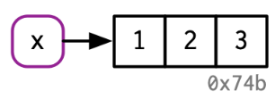
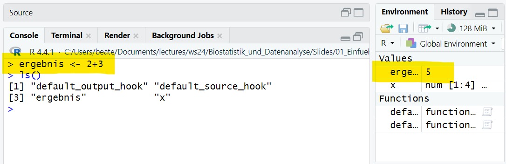
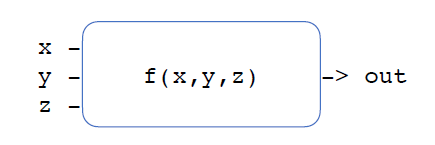
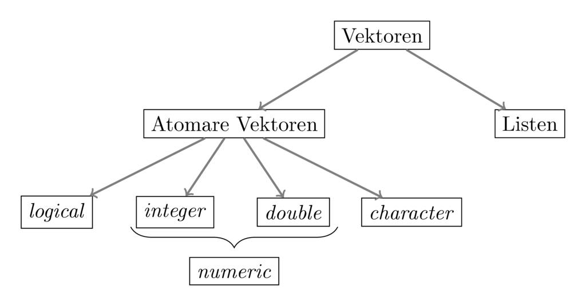
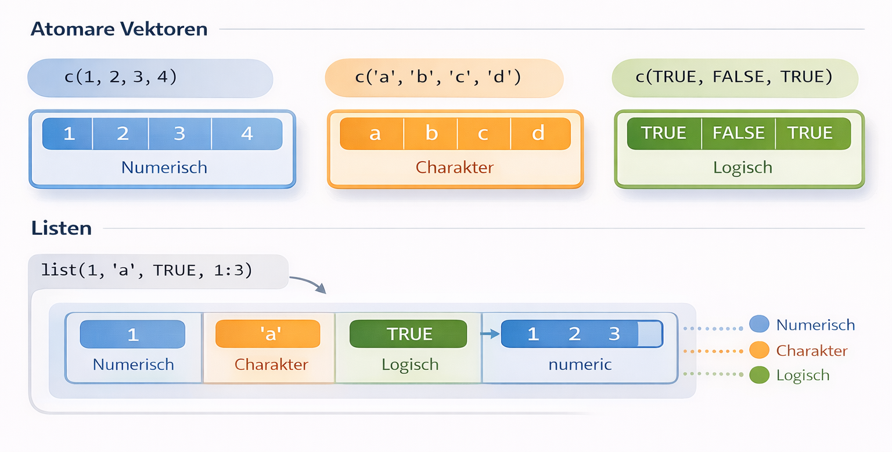

## Objekte, Funktionen und Zuweisungen

Wir haben sie im letzten Kapitel schon kennengelernt: Objekte, Funktionen und Zuweisungen. Jetzt wollen wir noch einmal etwas genauer auf diese Begriffe eingehen. Das Verständnis dieser Konzepte bildet die Grundlage für alle weiteren Schritte in R.

### Was ist ein R Objekt?

Um Berechnungen in R zu verstehen, sind zwei Leitsätze hilfreich:

> *Everything that exists is an object.*  
> *Everything that happens is a function call.*  
> — John Chambers
  
Objekte sind ein fundamentales Konzept in R. Tatsächlich gilt: **Alles ist ein Objekt** – Zahlen, Zeichenketten, Vektoren, Funktionen und sogar ganze Datensätze.

Jedes Objekt existiert im Arbeitsspeicher von R und kann dort weiterverwendet, verändert oder gelöscht werden.

### Funktionen in R

Funktionen sind vordefinierte oder selbst geschriebene **Algorithmen**, die einen oder mehrere **Eingabewerte (Input)** verarbeiten und daraus einen **Ausgabewert (Output)** erzeugen.

Ein einfaches Beispiel ist die Addition zweier Zahlen:

```{r echo=TRUE}
2 + 3
```

R gibt das Ergebnis `5` zwar direkt aus, es wird jedoch nicht gespeichert.
Nach der Berechnung ist das Resultat nicht mehr verfügbar.


### Variablen und Zuweisungen

Um Zwischenergebnisse oder ganze Datensätze weiterverwenden zu können, müssen sie in Variablen gespeichert werden. Der Vorgang, bei dem einem Objekt ein Name zugewiesen wird, heißt Zuweisung (engl. *assignment*).

Eine Möglichkeit ist die Verwendung der Funktion `assign()`:

```{r echo = TRUE}
  assign("ergebnis", 2+3)
  ergebnis
```
Häufiger wird jedoch der Zuweisungsoperator `<-` verwendet:

**Beispiele:**

```{r echo = TRUE}
  x <- 2
  y <- 3
  z <- x + y
```

Nach einer Zuweisung ist ein Symbol (z. B. `x`) mit einem konkreten Wert im Arbeitsspeicher von R verknüpft. Dieses Objekt kann anschließend in weiteren Berechnungen verwendet werden.

::: {.callout-note}
**Warum `<-` als Zuweisungsoperator?**

Die Verwendung der Zeichenfolge `<-` als Zuweisungsoperator wirkt auf den ersten Blick ungewohnt, da in vielen Programmiersprachen stattdessen das Gleichheitszeichen `=` verwendet wird. Der Operator `<-` hat jedoch mehrere Vorteile. Er macht die Richtung der Zuweisung klar sichtbar: Ein Wert wird einem Namen zugewiesen, nicht umgekehrt.

Historisch stammt `<-` aus der Programmiersprache S, aus der R hervorgegangen ist. S wiederum übernahm diesen Operator aus der Sprache APL, für die es spezielle Tastaturen mit einer eigenen `<-`-Taste gab. Hinzu kommt, dass das Gleichheitszeichen `=` ursprünglich bereits für Vergleiche reserviert war. Zwar erlaubt R seit 2001 auch Zuweisungen mit `=`, dennoch gilt `<-` aufgrund der besseren Lesbarkeit und klareren Semantik weiterhin als empfohlener Standard.
:::


Quelle: [R für sozioökonomische Forschung](https://graebnerc.github.io/RforSocioEcon/basics.html#es:objekte)


### Zuweisungen

```{r echo = TRUE}
x <- c(1,2,3)
```

-   Ein Objekt wird erstellt, nämlich `c(1,2,3)`
-   Das Objekt wird einem Namen zugewiesen, $x$

{#fig-r-konsole}

### Benennung von Variablen

Beim Arbeiten mit R ist eine korrekte und sinnvolle Benennung von Variablen besonders wichtig.  
Variablennamen dienen dazu, Objekte im Arbeitsspeicher eindeutig zu identifizieren und später wiederzuverwenden.

#### Groß- und Kleinschreibung

R unterscheidet strikt zwischen Groß- und Kleinschreibung. Das bedeutet, dass unterschiedliche Schreibweisen auch unterschiedliche Variablen bezeichnen:

- `x1` und `X1` sind zwei verschiedene Variablen
- Gleiches gilt für Funktionsnamen

#### Erlaubte Zeichen

Variablennamen dürfen ausschließlich bestehen aus:

- Buchstaben (`a`–`z`, `A`–`Z`)
- Zahlen (`0`–`9`)
- den Sonderzeichen `.` (Punkt) und `_` (Unterstrich)

Dabei gelten folgende Regeln:

- Variablennamen **dürfen nicht mit einer Zahl beginnen**
- Variablennamen **dürfen nicht mit einem Punkt `.` beginnen**

Beispiele für gültige Variablennamen sind:

- `x1`
- `X1`
- `min.dist`
- `Best.gene`

#### Ungültige Namen und Fehlermeldungen

Bestimmte Bezeichnungen sind in R **reserviert** und dürfen nicht als Variablennamen verwendet werden.  
Dazu gehören unter anderem logische Konstanten wie `TRUE` und `FALSE`.

Wird dennoch versucht, einer solchen Bezeichnung einen Wert zuzuweisen, gibt R eine Fehlermeldung aus:
    ```         
    TRUE <- 5   # Signalwort, welches nicht verwendet werden darf
    #> Error in TRUE <- 5: invalid (do_set) left-hand side to assignment
    ```
       
Diese Fehlermeldung weist darauf hin, dass die linke Seite der Zuweisung ungültig ist.

Alle aktuell im Arbeitsspeicher vorhandenen Objekte werden in RStudio im Bereich Environment angezeigt. Zusätzlich kann die Funktion `ls()` verwendet werden, um alle aktuellen Namenszuweisungen in der Konsole auszugeben:

{#fig-r-variable}

::: {.callout-tip}
**Gute Variablennamen**

- Verwenden Sie sprechende Namen, die den Inhalt beschreiben (z. B. alter, gewicht_kg).
- Vermeiden Sie sehr kurze oder nichtssagende Namen wie x oder tmp, außer bei kurzen Beispielen.
- Bleiben Sie bei einer einheitlichen Schreibweise (z. B. Unterstriche oder Punkte).
- Nutzen Sie keine reservierten Wörter oder Funktionsnamen als Variablennamen.
- Gut gewählte Namen verbessern die Lesbarkeit und Wartbarkeit von Code erheblich.
:::

## Funktionen

Funktionen sind ein zentrales Konzept in R. Sie können als **Blackboxen** verstanden werden: Eine Funktion erhält einen oder mehrere Eingabewerte, verarbeitet diese intern und liefert anschließend ein Ergebnis zurück.

Symbolisch lässt sich eine Funktion als $f(x, y, z)$ darstellen. Dabei lassen sich drei zentrale Aspekte unterscheiden:

- **Eingang (Input):**  
  Die Eingabewerte einer Funktion werden als **Parameter** oder **Argumente** bezeichnet. Einige dieser Parameter können mit **Standardwerten** vorbelegt sein.

- **Ausgang (Output):**  
Das Ergebnis einer Funktion ist immer ein **R-Objekt**, zum Beispiel eine Zahl, ein Vektor oder ein komplexerer Datentyp.

- **Seiteneffekte:**  
Zusätzlich zum eigentlichen Rückgabewert kann eine Funktion weitere Effekte haben, etwa:
  - Textausgaben in der Konsole  
  - das Erzeugen von Dateien  
  - das Öffnen von Grafik- oder Hilfefenstern  

{#fig-r-function}

### Funktionsaufrufe

Funktionen können unbenannte oder benannte Parameter akzeptieren:

-   Benannte Parameter besitzen Standard-Werte

```{r echo = TRUE,tidy = TRUE}
x <- c(1,NA,6)
mean(x)
```

-   Benannte Parameter müssen mit "=" abgetrennt werden

```{r echo = TRUE,tidy = TRUE}
x <- c(1,NA,6)
mean(x,na.rm=TRUE)
```

### Wichtige Basis-Funktionen

| Funktionen                 | Bedeutung                                    |
|----------------------------|--------------------------------------------|
| `log()`, `exp()`           | Natürlicher Logarithmus, Exponentialfunktion |
| `sin()`, `cos()`, `tan()`  | Trigonometrische Funktionen                  |
| `sqrt()`, `abs()`          | Wurzel, Absolutwert                          |
| `sum()`, `cumsum()`        | Summe, kumulative Summe                      |
| `prod()`, `diff()`         | Produkt, Differenzen                         |
| `mean()`, `var()`          | Mittelwert, Varianz                          |
| `max()`, `min()`           | Maximalwert, Minimalwert                     |
| `which.min()`, `which.max` | Index des Maximal-/Minimalwertes             |
| `which()`                  | Indizes, deren Elemente TRUE sind            |
| `sort()`,`order()`         | Sortiere Vektor, Ordnung des Vektors         |
| `rank()`                   | Rangzuweisung                                |

### Funktionen in der beschreibenden Statistik

| Funktionen   | Bedeutung                                               |
|--------------|---------------------------------------------------------|
| `mean()`     | Mittelwert                                              |
| `median()`   | Median                                                  |
| `var()`      | Varianz                                                 |
| `sd()`       | Standard-Abweichung                                     |
| `min()`      | Minimum                                                 |
| `max()`      | Maximum                                                 |
| `range()`    | Wertebereich                                            |
| `IQR()`      | Interquartilbereich                                     |
| `quantile()` | Quantile                                                |
| `table()`    | Häufigkeitstabelle                                      |
| `summary()`  | Min, max, mean, median und das erste und dritte Quartil |


### Eigene Funktionen definieren 

- Reserviertes Schlüsselwort: `function`
- Beispiel: Bestimmung der Länge der Hypothenuse über Satz des Pythagoras

```{r echo = TRUE,tidy = TRUE}
# Definition der Funktion
pythagoras <- function(kathete_1, kathete_2){
  hypo_quadrat <- kathete_1**2 + kathete_2**2
  hypothenuse <- sqrt(hypo_quadrat) # sqrt() zieht die Quadratwurzel
  return(hypothenuse)
}

# Aufruf der Funktion
pythagoras(2, 4)
```


### Einfache Datentypen

R stellt verschiedene Datentypen zur Verfügung, um unterschiedliche Arten von Informationen darzustellen. Grundsätzlich unterscheidet man zwischen einfachen und zusammengesetzten Datentypen.

Zu den einfachen Datentypen gehören:

- `logical` – logische Werte  
- `integer` – ganze Zahlen  
- `double` – Fließkommazahlen  
- `character` – Zeichenketten  
- `factor` – kategoriale Daten  

Daneben existieren zusammengesetzte Datentypen, die mehrere Werte oder Strukturen enthalten können, zum Beispiel:

- `vector`, `list`
- `matrix`, `array`
- `data.frame`
- `function`

**Beispiele für einfache Datentypen**

Die wichtigsten einfachen Datentypen lassen sich wie folgt illustrieren:

- **Logische Werte:** `TRUE`, `FALSE`  
- **Ganzzahlen (Integer):** `42`, `-15`  
- **Fließkommazahlen (Double):** `0.3`, `1.25e-12`  
- **Zeichenketten (Character):** `"this is my string"`

```{r echo=TRUE}
iamhappy <- TRUE
mynumber <- 4
n2 <- 0.3
hello <- "world"
```

::: {.callout-note}
**Dynamische Typisierung**

R ist eine dynamisch typisierte Programmiersprache. Das bedeutet, dass beim Programmieren nicht explizit angegeben werden muss, welchen Datentyp eine Variable besitzt. Der Datentyp ergibt sich automatisch aus dem zugewiesenen Wert.
:::

#### Fließkommazahlen

Fließkommazahlen werden in R als double gespeichert. Aufgrund der internen Darstellung können dabei Rundungsfehler auftreten.

```{r echo = TRUE}
sqrt(2)
```

```{r echo = TRUE}
sqrt(2)^2
```

Auf den ersten Blick scheint das Ergebnis exakt zu sein.
Ein direkter Vergleich mit `==` liefert jedoch ein überraschendes Resultat:
```{r echo = TRUE}
sqrt(2) == 2
```

Zum Nachlesen: <https://r-intro.tadaa-data.de/datentypen>

Fließkommazahlen sollten nicht direkt mit `==` verglichen werden. Stattdessen empfiehlt sich ein Vergleich mit einer kleinen Toleranz.

```{r echo = TRUE}
  x <- 1.1 - 0.2
  y <- 0.9
  eps <- 0.000000001
  print(abs(x - y) < eps)
```

Hier wird geprüft, ob sich die beiden Werte nur um einen sehr kleinen Betrag unterscheiden.

#### Besondere Konstanten in R

R kennt mehrere spezielle Konstanten, die in der Datenanalyse häufig auftreten:

- `NA`: not available (Fehlender Wert)

- `Inf`, `-Inf`: Unendlich (double)
```{r echo = TRUE}
10^1000
```
  
- `NaN`: *not a number*
```{r echo = TRUE}
0/0
```

### Logische Werte

Logische Ausdrücke werden in R verwendet, um Bedingungen zu formulieren und Entscheidungen zu treffen. Die grundlegenden logischen Operatoren sind:

 `|` (oder), `&` (und), `!` (nicht).

Das folgende Beispiel zeigt einfache logische Verknüpfungen mit logischen Variablen:

```{r echo = TRUE}
  itsRaining <- TRUE
  SprinklerOn <- FALSE

  I.get.wet <- itsRaining | SprinklerOn
  dry <- (!itsRaining) & (!SprinklerOn)
```

Für logische Vektoren stellt R spezielle Funktionen bereit, um Aussagen über alle oder einzelne Elemente zu treffen:
-   `all()`: Alle Elemente sind wahr.
-   `any()`: Es existiert ein Element, das wahr ist.

::: {.callout-warning}
**Typische Fehler bei logischen Vergleichen in R**

**Verwendung von `=` statt `==`**  
Der Operator `=` dient der Zuweisung, während `==` für den Vergleich auf Gleichheit verwendet wird.

**Direkter Vergleich von Fließkommazahlen**  
Aufgrund von Rundungsfehlern sollten numerische Werte nicht direkt mit `==` verglichen werden. Verwenden Sie stattdessen einen Vergleich mit Toleranz, z. B. `abs(x - y) < eps`.

**Unbeachtete fehlende Werte (`NA`)**  
Logische Ausdrücke mit `NA` liefern oft ebenfalls `NA`. Vor logischen Vergleichen sollten fehlende Werte geprüft oder behandelt werden.

**Verwendung von `==` statt `all()` oder `any()` bei Vektoren**  
Der Vergleich eines logischen Vektors mit `TRUE` oder `FALSE` ist meist nicht sinnvoll. Nutzen Sie `all()` oder `any()`, um Aussagen über mehrere Werte zu treffen.
:::

### Tests und Umwandlungen

R stellt Funktionen zur Überprüfung und Umwandlung von Datentypen bereit, darunter:
- `is.na()` – prüft, ob ein Wert fehlt (NA)
- `is.numeric()` - prüft, ob ein Objekt numerisch ist
- `as.integer()` - wandelt einen Wert in einen Integer um

## Vektoren

### Übersicht

{#fig-vektor}
Vektoren sind die zentrale Datenstruktur in R, da viele Funktionen automatisch elementweise auf Vektoren arbeiten.

Man unterscheidet zwei wichtige Typen:

- **Atomare Vektoren** enthalten Elemente des gleichen Datentyps (z. B. nur Zahlen, nur Zeichenketten oder nur logische Werte).
- **Listen** können Elemente unterschiedlicher Datentypen enthalten, z. B. Zahlen, Zeichenketten oder sogar andere Vektoren.

{#fig-vektorlist}

### Erzeugen von Vektoren

Es gibt verschiedene Möglichkeiten, Vektoren in R zu erzeugen.

Mit `c()` (combine):
Mit der Funktion `c()` können mehrere Werte zu einem Vektor zusammengefasst werden.

```{r echo = TRUE}
c(1,1.5,2)
```
Hier wird ein numerischer Vektor mit drei Elementen erzeugt.

Mit `double()`:
Die Funktion `double(n)` erzeugt einen numerischen Vektor der Länge $n$, dessen Elemente zunächst alle den Wert 0 haben.
```{r echo = TRUE}
double(5)
```
Dies ist z. B. nützlich, wenn man einen Vektor vorab reservieren möchte.
 
Mit dem Sequenzoperator `:`:
Mit `:` kann man eine einfache Folge von ganzen Zahlen erzeugen.
```{r echo = TRUE}
1:5
```

Mit `rep()`:
Die Funktion `rep()` wiederholt einen Wert oder einen Vektor eine bestimmte Anzahl von Malen.
```{r echo = TRUE}
rep(3,5)
```
Hier wird die Zahl 3 fünfmal wiederholt.

Mit `seq()`:
Mit `seq()` kann man allgemeinere Zahlenfolgen erzeugen.
```{r echo = TRUE}
seq(0,0.6, 0.2)
```
Hier beginnt die Folge bei 0, endet bei 0.6 und erhöht sich jeweils um 0.2.

### Indizierung
Mit Hilfe von Indizes kann man auf einzelne Elemente eines Vektors zugreifen.
In R beginnt die Zählung bei 1 (nicht bei 0 wie in manchen anderen Programmiersprachen).

Für einen Vektor `x` mit der Länge `length(x)` sind daher die gültigen Indizes `1...length(x)`.
Der Zugriff auf Elemente erfolgt mit eckigen Klammern.
  
```{r echo = TRUE,tidy = TRUE}
x <- c(1.7, 3.8, 4.2, 5.7)
x[2] # zweites Element 
x[2:3] # Elemente 2 bis 3
x[c(4,4,1)] # Auswahl mehrerer Positionen (auch mehrfach möglich)
x[-c(1,2)] # entferne Elemente an Position 1 und 2
```

::: {.callout-note}
## Merksatz zur Indizierung

- `x[i]` → einzelnes Element  
- `x[i:j]` → zusammenhängender Bereich  
- `x[c(...)]` → beliebige Auswahl  
- `x[-i]` → Ausschluss von Positionen
:::  

### Logische Indizierung

In R können Vektoren nicht nur über numerische Positionen, sondern auch über logische Werte (`TRUE` und `FALSE`) indiziert werden. Dabei bestimmt jeder logische Wert, ob ein Element ausgewählt wird oder nicht.

- `TRUE` → Element wird ausgewählt  
- `FALSE` → Element wird nicht ausgewählt  

Der logische Vektor muss dabei die gleiche Länge wie der Vektor haben, auf den er angewendet wird.

**Beispiel**

```r
x <- c(1.7, 0.5, -0.7, 0, 2.8, 0.2)
x[c(TRUE, TRUE, FALSE, FALSE, TRUE, TRUE)]
```
Der logische Indexvektor entscheidet, welche Werte aus `x` übernommen werden.

| Position | Wert in `x` | Logischer Wert | Ergebnis |
|---|---|---|---|
|1|1.7|TRUE|wird übernommen|
|2|0.5|TRUE|wird übernommen|
|3|-0.7|FALSE|wird ignoriert|
|4|0|FALSE|wird ignoriert|
|5|2.8|TRUE|wird übernommen|
|6|0.2|TRUE|wird übernommen|

Das Ergebnis lautet:

```r
[1] 1.7 0.5 2.8 0.2
```

**Merksatz**

> **Ein logischer Vektor wirkt wie ein Filter:**  
> `TRUE` lässt ein Element passieren, `FALSE` entfernt es.

#### Filtern von Vektoren mit Bedingungen

Eine sehr häufige Anwendung der logischen Indizierung ist das Filtern von Vektoren anhand von Bedingungen. Dabei wird eine Bedingung auf jedes Element eines Vektors angewendet. Das Ergebnis ist ein **logischer Vektor**, der anschließend als Index verwendet werden kann.

**Beispiel**

```r
x <- c(0.3, 0.1, 5.7, -1.0)
y <- c(2, 3, 1, 5)

x > 0
```

Der Ausdruck `x > 0` überprüft für jedes Element von `x`, ob es größer als 0 ist.  
Das Ergebnis ist ein logischer Vektor:

```r
[1] TRUE TRUE TRUE FALSE
```

Dieser logische Vektor kann direkt als Index verwendet werden:

```r
x[x > 0]
```

Ergebnis:

```r
[1] 0.3 0.1 5.7
```

Alle Werte von `x`, die größer als 0 sind, werden ausgewählt.

---

**Merksatz**

> Eine Bedingung erzeugt einen logischen Vektor, der direkt zum Filtern eines Vektors verwendet werden kann.

---

#### Positionen mit `which()`

Manchmal interessiert nicht der Wert selbst, sondern **an welcher Position im Vektor** sich ein Element befindet, das eine bestimmte Bedingung erfüllt. Dafür gibt es die Funktion `which()`.

**Beispiel**

```r
which(x > 0)
```

Ergebnis:

```r
[1] 1 2 3
```

Das bedeutet: Die ersten drei Elemente von `x` sind größer als 0.

---

**Merksatz**

> `which()` gibt die Positionen der Elemente zurück, die eine Bedingung erfüllen.

---

#### Konkatenierung von Vektoren

Mit der Funktion `c()` (combine) können mehrere Vektoren zu einem neuen Vektor zusammengefügt werden.

**Beispiel**

```r
c(x, y)
```

Ergebnis:

```r
[1] 0.3 0.1 5.7 -1.0 2 3 1 5
```

Die Elemente des zweiten Vektors werden dabei einfach an den ersten Vektor angehängt.

---

**Merksatz**

> Mit `c()` können mehrere Werte oder Vektoren zu einem neuen Vektor kombiniert werden.

---

### Skalare Operationen
  
**Skalare** Operationen werden für jedes Element einzeln durchgeführt.
  
```{r echo = TRUE}
x <- c(1,1.5,2)
x+2
```
  
```{r echo = TRUE}
x-2
```
  
```{r echo = TRUE}
x*2
```
  
```{r echo = TRUE}
x/2
```

### Arithmetik mit Vektoren

In R können **arithmetische Operationen direkt auf Vektoren** angewendet werden.  
Dabei werden die Operationen **elementweise** ausgeführt. Das bedeutet, dass die entsprechenden Elemente zweier Vektoren miteinander verrechnet werden.

#### Arithmetik auf Vektoren gleicher Länge

Wenn zwei Vektoren **dieselbe Länge** besitzen, werden ihre Elemente paarweise kombiniert.

**Beispiel: Addition**

```{r echo=TRUE}
c(1,2,3) + c(1.2,-0.5,-0.1)
```

**Beispiel: Subtraktion**

```{r echo=TRUE}
c(1,2,3) - c(1.2,-0.5,-0.1)
```

**Beispiel: Multiplikation**

```{r echo=TRUE}
c(1,2,3) * c(1.2,-0.5,-0.1)
```

**Beispiel: Division**

```{r echo=TRUE}
c(1,2,3) / c(1.2,-0.5,-0.1)
```

**Merksatz**

> Arithmetische Operationen auf Vektoren werden elementweise ausgeführt.

---

### Arithmetik mit Vektoren unterschiedlicher Länge (Recycling)

Sind die Vektoren unterschiedlich lang, verwendet R das sogenannte **Recycling-Prinzip**.  
Dabei wird der kürzere Vektor wiederholt, bis er die Länge des längeren Vektors erreicht.

**Beispiel**

```{r echo=TRUE}
c(1,1,1,1,1) * c(1,2,3)
```

Intern interpretiert R dies als:

```{r echo=TRUE}
c(1,1,1,1,1) * c(1,2,3,1,2)
```


**Merksatz**

> Ist ein Vektor kürzer, wird er in R automatisch wiederholt (Recycling).

---

### Funktionen auf Vektoren

Viele mathematische Funktionen können sowohl mit **einzelnen Zahlen (Skalaren)** als auch mit **Vektoren** arbeiten.

#### Skalare Funktionen auf Vektoren

Eine skalare Funktion hat mathematisch die Form

$$f:\mathbb{R} \rightarrow \mathbb{R}$$

Sie wird auf jedes Element eines Vektors einzeln angewendet.

**Beispiel: Eingabe eines Skalars**

```r
exp(1)
```

**Beispiel: Eingabe eines Vektors**

```r
exp(c(0,1,2,3))
```

Das Ergebnis enthält die Exponentialfunktion für jedes einzelne Element.

**Merksatz**

> Viele Funktionen in R arbeiten automatisch elementweise auf Vektoren.

---

#### Vektorwertige Eingaben

Einige Funktionen erwarten **Vektoren als Argumente** und berechnen daraus einen einzelnen Wert.

Mathematisch entspricht dies Funktionen der Form

$$f:\mathbb{R}^n \rightarrow \mathbb{R}$$

**Beispiel: Mittelwert**

```{r echo=TRUE}
mean(c(1.2,-0.5,-0.1))
```

Der Mittelwert fasst mehrere Werte zu einer einzelnen Kennzahl zusammen.

---

**Beispiel: Korrelation**

```{r echo=TRUE}
cor(c(1.2,-0.5,-0.1), c(2.2,0.5,0.9))
```

Die Funktion `cor()` berechnet die Korrelation zwischen zwei Vektoren, also ein Maß für den linearen Zusammenhang zwischen zwei Variablen.

---

**Beispiel: Skalarprodukt**

```{r echo=TRUE}
c(1,2,3) %*% c(1.2,-0.5,-0.1)
```

Das Skalarprodukt multipliziert die entsprechenden Elemente und summiert anschließend die Ergebnisse.

**Merksatz**

> Einige Funktionen verarbeiten ganze Vektoren und geben eine einzelne Kennzahl zurück.

---

#### Länge eines Vektors bestimmen

```r
a <- c(1,2,3)
length(a)
```

Die Funktion `length()` gibt die Anzahl der Elemente eines Vektors zurück.

### Wichtige Funktionen für Vektoren

| Operator/Funktion | Bedeutung |
|---|---|
| `1:5` | erzeugt den Vektor `1 2 3 4 5` |
| `seq(from,to,by)` | erzeugt eine lineare Sequenz von Werten |
| `rep(0.3,4)` | wiederholt einen Wert mehrfach |
| `c(1,3,9)` | erzeugt einen Vektor |
| | kombiniert mehrere Werte oder Vektoren |
| `logical(n)` | logischer Vektor der Länge `n` |
| `integer(n)` | Ganzzahlvektor der Länge `n` |
| `double(n)` | numerischer Vektor der Länge `n` |
| `character(n)` | Zeichenkettenvektor der Länge `n` |
| `length(v)` | Länge eines Vektors |
| `names(v)` | Namen der Vektorelemente |

---

## Matrizen

### Was ist eine Matrix?

Eine Matrix ist ein zweidimensionaler Container, der aus Zeilen und Spalten besteht.

Wichtige Eigenschaften:

- eine Matrix hat die Dimension Zeilen × Spalten
- alle Elemente besitzen denselben Datentyp
- häufig verwendete Datentypen sind numeric, integer oder character

Matrizen werden in R häufig für numerische Berechnungen, lineare Algebra und statistische Analysen verwendet.

### Matrix erzeugen

Eine Matrix wird mit der Funktion `matrix()` erzeugt.

```{r echo=TRUE }
x <- matrix(1:6, nrow = 2, ncol = 3)
print(x)
```
Was passiert hier:

- 1:6 erzeugt einen Vektor mit den Zahlen 1 bis 6
- nrow = 2 legt die Anzahl der Zeilen fest
- ncol = 3 legt die Anzahl der Spalten fest

R füllt Matrizen standardmäßig spaltenweise.

### Indizierung von Matrizen

Der Zugriff auf einzelne Elemente oder Teilbereiche einer Matrix erfolgt in R über Indizierung. Dabei wird die allgemeine Syntax 

```
x[Zeile, Spalte]
```
verwendet. Der erste Index gibt die Zeile, der zweite Index die Spalte an. Auf diese Weise lassen sich einzelne Werte, ganze Zeilen, ganze Spalten oder auch mehrere Spalten gleichzeitig auswählen.

Im folgenden Beispiel wird eine bereits definierte Matrix `x` verwendet.

```{r echo = TRUE,tidy = TRUE}
# Zugriff auf ein einzelnes Element
print(x[1,3])
# Zugriff auf eine ganze Zeile
print(x[2,])
# Zugriff auf eine ganze Spalte
print(x[,2])
# Zugriff auf mehrere Spalten
print(x[,1:2])
x <- matrix(1:6, nrow=2, ncol=3)
print(x)
# Ganze Zeile als Matrix
print(x[2,,drop=FALSE])
# Ganze Spalte als Matrix
print(x[,2,drop=FALSE])
```

Der Ausdruck `x[2,,drop=FALSE]` gibt die zweite Zeile der Matrix zurück. Durch `drop = FALSE` bleibt das Ergebnis eine 1×3-Matrix.

Analog liefert `x[,2,drop=FALSE]` die zweite Spalte der Matrix als 2×1-Matrix.

Die Verwendung von `drop = FALSE` ist besonders hilfreich, wenn nachfolgende Berechnungen eine Matrixstruktur voraussetzen und nicht mit einem Vektor arbeiten sollen.

### Lineare Indizierung

Neben der zweidimensionalen Indizierung über Zeilen und Spalten unterstützt R auch eine lineare Indizierung von Matrizen. Dabei wird die Matrix intern als Vektor betrachtet. Die Elemente werden standardmäßig spaltenweise angeordnet.

Das bedeutet, dass zuerst alle Elemente der ersten Spalte, danach die der zweiten Spalte und anschließend die der weiteren Spalten berücksichtigt werden.

Im folgenden Beispiel wird zunächst eine Matrix erzeugt und anschließend verschiedene Formen der linearen Indizierung demonstriert.

```{r echo = TRUE,tidy = TRUE}
x <- matrix(1:6, nrow=2, ncol=3)
print(x)
print(x[x<3])
print(x[1])
```

### Zeilen und Spaltennamen

Zeilen und Spalten können benannt werden:
- `colnames()`
- `rownames()` 

```{r echo = TRUE,tidy = TRUE}
colnames(x) <- c("C1", "C2", "C3")
rownames(x) <- c("R1", "R2")
print(x)
```

### Matrizen – Wichtige Funktionen


| *Funktion*                       | *Bedeutung*                         |
|----------------------------------|---------------------------------------|
| `matrix()`                       | Matrix erzeugen                       |
| `dim()`, `ncol()`, `nrow()`      | Anzahl Zeilen und Spalten             |
| `t()`                            | Transponieren einer Matrix            |
| `x[i]`                           | Spaltenweise Vektorisierung           |
| `%*%`                            | Matrixmultiplikation                  |
| `solve()`                        | Matrixinverse/Lösung von lin.gl.Sys.  |
| `diag()`                         | Hauptdiagonale der Matrix          |

## Listen

Listen sind ein flexibler Datentyp in R. Sie können Elemente unterschiedlicher Typen enthalten, z. B. Zeichenketten, Vektoren oder Matrizen.

### Erstellen einer Liste

Eine Liste wird mit der Funktion `list()` erzeugt:

```{r echo = TRUE,tidy = TRUE}
L <- list("hallo", c(1, 3, 7), matrix(1:6, 3))
print(L)
```

Die Liste `L` enthält hier drei Elemente:

- eine Zeichenkette (`"hallo"`)
- einen numerischen Vektor (`c(1, 3, 7)`)
- eine Matrix (`matrix(1:6, 3)`)

Auf einzelne Elemente kann man über **Indizes** zugreifen.

::: {.callout-tip}
## Merke: Zugriff auf Listenelemente

In R gibt es drei Möglichkeiten, auf Elemente einer Liste zuzugreifen:

- `L[i]`  
  Gibt eine Teilliste zurück.

- `L[[i]]`  
  Gibt das eigentliche Element der Liste zurück.

- `L$name`  
  Greift auf ein benanntes Element zu.
:::

**Beispiel**

```r
L <- list(x = 5, y = c(1, 7))

L[1]     # Teilliste
L[[1]]   # Element selbst (5)
L$x      # Zugriff über den Namen
```


### Benannte Listen

Listen können auch benannte Elemente besitzen. Dadurch lassen sich Elemente leichter und verständlicher ansprechen.

```{r echo = TRUE,tidy = TRUE}
L <- list(x=5, y=c(1,7), z=matrix(0,2,3))
print(L$x)
```

Hier hat die Liste drei benannte Elemente:

- `x` enthält die Zahl `5`
- `y` enthält den Vektor `c(1, 7)`
- `z` enthält eine `2 × 3`-Matrix mit Nullen

Mit dem `$`-Operator kann direkt auf ein Element über seinen Namen zugegriffen werden (z. B. `L$x`).
  
## Übungen

**Übung 1**

1. Schreiben Sie eine Funktion mit dem Namen `myFunc`, die die Summe der Parameter x und y zurückgibt
2. Spezifizieren Sie als Default Werte für x und y jeweils 0
3. Wenn die Summe > 20 ist, soll die Funktion ``Hey, voll viel" zurückgeben. Sonst "Eher wenig". 

**Übung 2**

In einer klinischen Studie werden bei mehreren Patientinnen und Patienten die **C-reaktiven Proteinwerte (CRP)** im Blut gemessen. CRP ist ein Laborwert, der bei Entzündungen im Körper erhöht sein kann. Die gemessenen CRP-Werte (in mg/L) seien in folgendem Vektor gespeichert:

```r
crp <- c(2.1, 8.4, 0.6, 12.3, 3.2, 15.7, 1.0)
```

In vielen klinischen Kontexten gelten CRP-Werte über 5 mg/L als Hinweis auf eine mögliche Entzündung.

Bearbeiten Sie folgende Aufgaben:

1. Erstellen Sie einen logischen Vektor, der überprüft, welche CRP-Werte größer als 5 mg/L sind.
2. Filtern Sie alle CRP-Werte über 5 mg/L aus dem Vektor.  
3. Bestimmen Sie mit `which()` die Positionen der Patientinnen und Patienten, bei denen der CRP-Wert über 5 mg/L liegt.  
4. In einer zweiten Messung werden zusätzliche CRP-Werte erhoben:

```r
crp_neu <- c(4.3, 9.8)
```

Kombinieren Sie die ursprünglichen Messwerte mit den neuen Messwerten zu einem gemeinsamen Vektor.

**Übung 3**

In einem Datensatz sind die **Herzfrequenzen (in Schlägen pro Minute)** von drei Patientinnen und Patienten vor und nach einer leichten Belastung gespeichert.

```r
ruhe <- c(68, 72, 75)
belastung <- c(95, 102, 110)
```

Bearbeiten Sie folgende Aufgaben:

1. Berechnen Sie die **Differenz zwischen Belastungs- und Ruhepuls** für jede Person.  
2. Berechnen Sie das **Produkt der beiden Vektoren**.  
3. Bestimmen Sie den **Mittelwert des Belastungspulses**.  
4. Berechnen Sie das **Skalarprodukt** der beiden Vektoren.

---
