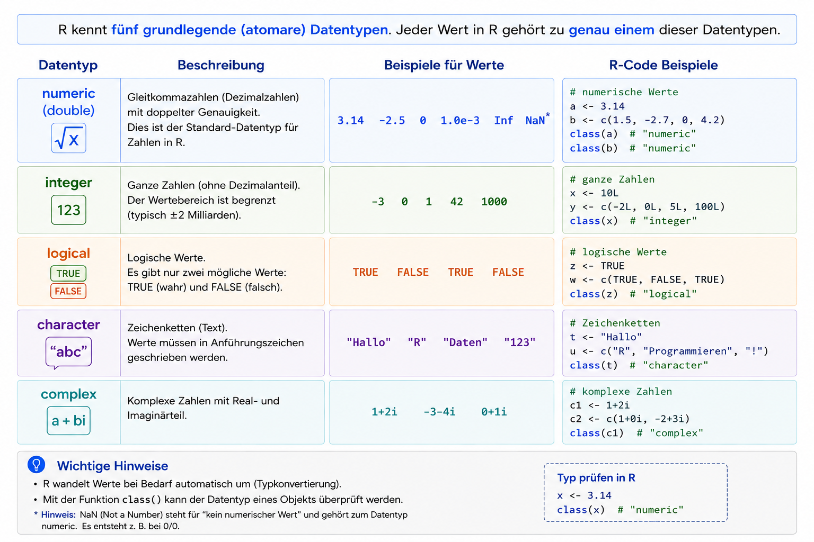
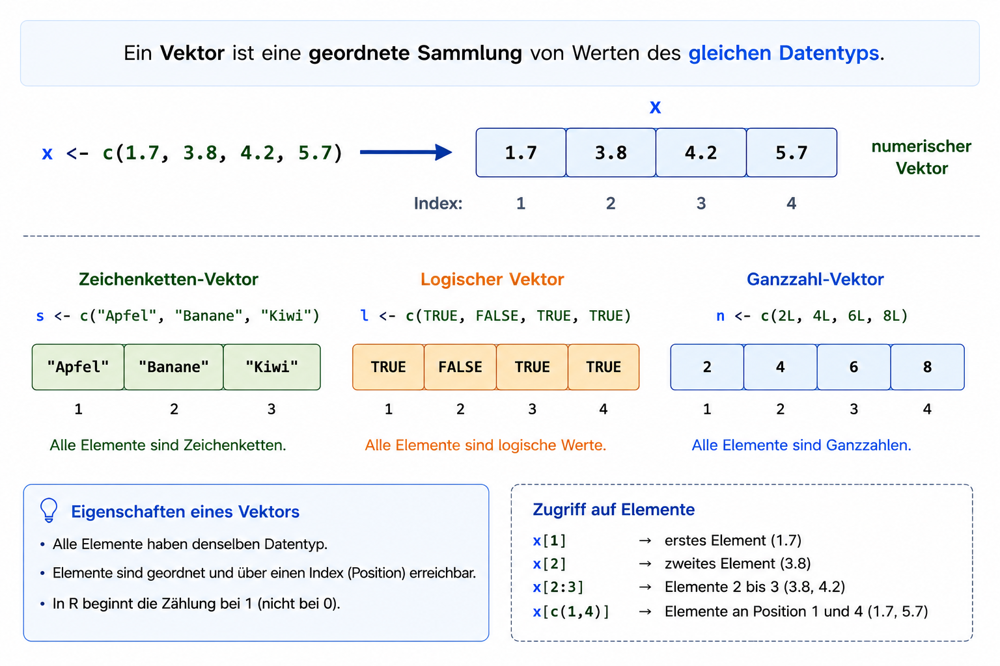

# Ablauf der Vorlesung

## Vorlesungsplan 

| Datum | Typ | Thema |
|---|---|---|
| 07.05 | Vorlesung | Einführung und Datentypen |
| 14.05 | keine Vorlesung |  |
| 21.05 | Vorlesung | Transformationen |
| 28.05 | Vorlesung | Datenaufbereitung (Tidyverse) |
| 04.06 | keine Vorlesung |  |
| 11.06 | Vorlesung | Visualisierung |
| 18.06 | Vorlesung | EDA und Graphen |
| 25.06 | Vorlesung | Testing \& Packaging |
| 02.07 | Vorlesung | Klausurvorbereitung  |


## Übung 

| Datum | Typ | Abgabe |
|---|---|---|
| 12.05 | Übung | 19.05 |
| 19.05 | Übung | 02.06 |
| 26.05 | keine Übung | - |
| 02.06 | Übung | 09.06 |
| 09.06 | Übung | 16.06 |
| 16.06 | Übung | 23.06 |
| 23.06 | Übung | keine Abgabe |
| 30.06 | Übung | keine Abgabe |

## Klausur

- in Abstimmung mit Bernd Hafenrichter
- 90 Minuten 
- Hälfte der Punktzahl mit R Programmierung erreichbar


# Erste Schritte in R 

## Lernziele

- R und RStudio installieren
- RStudio-Oberfläche kennenlernen
- Pakete installieren und laden
- sauberen und reproduzierbaren Code schreiben
- R als Taschenrechner verwenden
- Funktionen und Argumente verstehen
- Hilfe in R nutzen
- Einfache Datentypen verstehen
- Mit Vektoren arbeiten

---

## Was ist R?

- Programmiersprache für:
  - Statistik
  - Datenanalyse
  - Visualisierung

- Interaktive Skriptsprache
- Plattformunabhängig:
  - Windows
  - macOS
  - Linux

---

## Eigenschaften von R

- Schrittweise Ausführung von Befehlen
- Ergebnisse sofort sichtbar
- Gut geeignet für:
  - Forschung
  - Statistik
  - Data Science

- Kombination aus:
  - imperativer Programmierung
  - funktionalen Konzepten

---

# Installation und Setup

---

## R installieren

Offizielle Webseite: <https://cloud.r-project.org>

Enthält

- aktuelle Versionen
- Dokumentation
- Manuals
- Bücher
- Blog

---

## RStudio installieren

RStudio: <https://www.rstudio.com>

Vorteile

- grafische Oberfläche für R
- komfortabler Skripteditor
- integrierte Hilfe
- Plot-Anzeige
- Paketverwaltung

---

## R starten

Windows

```text
C:\Program Files\R\R-x.x.x\bin
```

Linux

```bash
R
```

---

## Arbeiten in der R-Konsole


{}

---

## Die R-Konsole

Eingabe

```r
1 + 2
```

Ausgabe

```text
[1] 3
```

Nützliche Funktion: alte Befehle mit Pfeiltasten abrufen

---

## Skripte in R

Warum Skripte?

- Code speichern
- erneut ausführen
- dokumentieren
- reproduzierbar arbeiten

Dateiendung

```text
.R
```

---

## Konsole vs. Skript

| Konsole | Skript |
|---|---|
| schnelle Tests | strukturierter Code |
| temporär | dauerhaft speicherbar |
| einzelne Befehle | komplette Analysen |

---

## RStudio Oberfläche


---

## Neues Skript erstellen

Menü

```text
File > New File > R Script
```

---

## Erstes Programm

```r
print("Hello, world")
```

---

## Programm ausführen

Tastenkombination

```text
Strg + Enter
```

Alternative: Button „Run“

---

## Beispiel: Hello World


---

## Funktionen in R

Allgemeine Struktur

```r
funktionsname(argumente)
```

Beispiel

```r
print("Hello, world")
```

---

## Funktionen und Argumente

```r
print("Hello, world")
```

- `print()` ist die Funktion
- `"Hello, world"` ist das Argument

---

## Zusatzpakete

Pakete enthalten zusätzlichen Code für:

- Statistik
- Datenanalyse
- Visualisierung
- Machine Learning

---

## Pakete installieren

```r
install.packages("dplyr")
```

---

## Installation mit Abhängigkeiten

```r
install.packages(
  "dplyr",
  dependencies = TRUE
)
```

Vorteil: notwendige Zusatzpakete werden automatisch installiert


# R als Taschenrechner 

---

## Grundrechenarten

- Addition `+`
- Subtraktion `-`
- Multiplikation `*`
- Division `/`
- Potenzen `^`

---

## Kommentare in R

```r
5 - 1/2  # Kommentar
```

Kommentare beginnen mit

```r
#
```

---

## Kommentare sind wichtig

- bessere Lesbarkeit
- Dokumentation
- Zusammenarbeit erleichtern
- spätere Nachvollziehbarkeit

---

## Arithmetische Ausdrücke

```r
(1 + 2) / (4 - 1.2) * 2^10
```

---

## Operatoren

| Operator | Bedeutung |
|---|---|
| `+` | Addition |
| `-` | Subtraktion |
| `*` | Multiplikation |
| `/` | Division |
| `^` | Potenz |

---

## Berechnen Sie

- $2^8$
- den Umfang eines Kreises mit $r=2$
- $log_{10}(1000)$
- Runden Sie $\pi$ auf 4 Nachkommastellen
- $\frac{\sqrt{25} + 3^2}{log_2(8)}$

---

## Achtung: `log()`

```r
log(x)
```
berechnet den natürlichen Logarithmus.

Logarithmus zur Basis 10

```r
log10(x)
```
---

## Prioritäten von Operatoren

Punkt vor Strich

```r
1 + 2 * 3
```

entspricht:

```r
1 + (2 * 3)
```

Klammern ändern die Reihenfolge

```r
(1 + 2) * 3
```

---

## Operatoren und Operanden

Operatoren verknüpfen oder verändern **Operanden**.
- Operanden = Werte oder Ausdrücke
- Operatoren = Rechen- oder Vergleichszeichen

Beispiele:

```r
2 + 3
5 * 8
x <- 4
```

---

## Binäre Operatoren

Binäre Operatoren arbeiten mit **zwei Argumenten**.

| Operator | Bedeutung |
|---|---|
| `+` | Addition |
| `-` | Subtraktion |
| `*` | Multiplikation |
| `/` | Division |
| `^` | Potenz |
| `<-` | Zuweisung |

---

## Linksassoziative Operatoren

Auswertung von links nach rechts

Beispiel

```r
1 / 2 / 3
```

R interpretiert dies als: $\left(\frac{1}{2}\right)/3$

---

## Rechtsassoziative Operatoren

Potenzoperator `^`: wird von rechts nach links ausgewertet

Beispiel
```r
2^3^4
```

Interpretation: $2^{(3^4)}$

Nicht: $(2^3)^4$

---

## Unäre Operatoren

Ein Argument: Unäre Operatoren arbeiten mit genau einem Operanden.

Beispiel: Negation

```r
!TRUE
```

Ergebnis:

```r
FALSE
```

---

## Operatoren als Funktionen

In R sind Operatoren intern Funktionen.

```r
7 + 3
```

ist identisch zu:

```r
`+`(7, 3)
```

Vergleich:

```r
7 + 3 == `+`(7, 3)
```

---

## Arithmetische Operatoren

| Operator | Bedeutung |
|---|---|
| `+` | Addition |
| `-` | Subtraktion |
| `*` | Multiplikation |
| `/` | Division |
| `^` | Potenz |
| `%/%` | Ganzzahlige Division |
| `%%` | Modulo |


---

## Arithmetische Operatoren 

Was ist hier jeweils das Ergebnis?

```r
5 %/% 2
5 %% 2
```
---

## Logische Operatoren

Vergleichsoperatoren

| Operator | Bedeutung |
|---|---|
| `<` | kleiner |
| `<=` | kleiner gleich |
| `>` | größer |
| `>=` | größer gleich |
| `==` | gleich |
| `!=` | ungleich |

---

## Logische Verknüpfungen

Wahrheitswerte kombinieren

| Operator | Bedeutung |
|---|---|
| `!x` | NICHT |
| `x & y` | UND |
| `x | y` | ODER |

Beispiel

```r
TRUE & FALSE
TRUE | FALSE
!TRUE
```

---

## Aufgabe

Definieren Sie folgende Variablen:

```r
itsRaining <- TRUE
haveUmbrella <- FALSE
```

Berechnen Sie anschließend:

1. Regnet es **und** haben Sie einen Regenschirm?
2. Regnet es **oder** haben Sie einen Regenschirm?
3. Bleiben Sie trocken, wenn Sie einen Regenschirm haben oder es nicht regnet?

---

## Arbeiten mit Vektoren

Vektoren werden mit `c()` erstellt.

Beispiel

```r
x <- c(1, 2, 5, 7)
```

Ausgabe:

```r
x
```

---

## Mittelwert berechnen

Funktion `mean()`

```r
x <- c(1, 2, 5, 7)

mean(x)
```

---

## Standardabweichung

Funktion `sd()`

```r
x <- c(1, 2, 5, 7)

sd(x)
```

---

## Runden mit `round()`

Ganze Zahlen

```r
round(7/3)
```

Mit Nachkommastellen

```r
round(7/3, digits = 3)
```

---

## Potenzen in R

Potenzoperator `^`

```r
10^5
```

---

## Wissenschaftliche Notation

Große und kleine Zahlen

$$
100000 = 1 \times 10^5 = 1e5
$$

$$
0.0012 = 1.2 \times 10^{-3} = 1.2e-3
$$

Beispiel in R

```{r echo = TRUE}
x <- 1 * 10^5
x
```

---

## Logarithmus Basis 10

Funktion `log10()`

```{r echo = TRUE}
10^6
```


```{r echo = TRUE}
log10(1e6)
```

---

## Logarithmus Basis 2

Funktion `log2()`

```{r echo = TRUE}
2^10
```

```{r echo = TRUE}
log2(1024)
```

---

## Natürlicher Logarithmus

Basis \(e\)

```{r echo = TRUE}
exp(1)
```

```{r echo = TRUE}
log(exp(1))
```

---

# Hilfe in R

## Hilfe in R

Hilfe aufrufen

```r
?mean
```

Alternative

```r
help("mean")
```

Suche

```r
help.search("mean")
```

---

## Aufgabe

1.  Wie erhalten Sie Hilfe zu der Funktion `floor`?
2.  Berechnen Sie das Quadrat von $\pi$ und runden Sie auf 4 Ziffern nach dem Dezimalpunkt
3.  Berechnen Sie den Logarithmus von 1 Milliarde mit Basis 1000.

---

# Variablen und Zuweisungen

## Ein ganz spezieller Zuweisungsoperator

Mit `<-`

```r
x <- 2
y <- 3
z <- x + y
```

---

## Warum `<-`?

- Richtung der Zuweisung sichtbar
- Historisch aus der Sprache S übernommen
- Bessere Lesbarkeit

---

## Variablennamen

*Regeln*

Erlaubt:
- Buchstaben
- Zahlen
- `_`
- `.`

Nicht erlaubt:
- Beginn mit Zahl
- reservierte Wörter

---

## Gültige Namen

Beispiele

```r
x1
X1
min.dist
Best.gene
```

---

## Ungültige Namen

Beispiel

```{ }
TRUE <- 5
```

```{}
Error
```

---

# Funktionen

## Funktionen als Blackbox

Input → Verarbeitung → Output

Beispiel

```r
mean(c(1,2,3))
```

---

## Parameter in Funktionen

Standardwerte

```r
x <- c(1, NA, 6)

mean(x, na.rm = TRUE)
```

---

## Eigene Funktionen

Funktion definieren

Satz des Pythagoras: $c = \sqrt{a^2 + b^2}$

```r
pythagoras <- function(a, b){

  hypo <- sqrt(a^2 + b^2)

  return(hypo)
}
```

Aufruf:

```r
pythagoras(2,4)
```

---

## Aufgabe

1.  Schreiben Sie eine Funktion mit dem Namen `myFunc`, die die Summe
    der Parameter x und y zurückgibt
2.  Spezifizieren Sie als Default Werte für x und y jeweils 0

---


## Scope in R

Lokale Variablen
```{r echo = TRUE}
x <- 10

demo <- function() {
  x <- 5
  x
}

print(demo())
print(x)
```

Das äußere `x` bleibt unverändert.

---

## Globale Variablen

Variablen außerhalb von Funktionen liegen meist im globalen Workspace.
```{r echo=TRUE}
patienten <- 120
```

Diese Variable kann auch innerhalb von Funktionen verwendet werden.
```{r echo=TRUE}
f <- function() {
  patienten * 2
}

f()
```

```r
[1] 240
```
Die Funktion greift auf die globale Variable `patienten` zu.

---

## Vorsicht mit `<<-`

Globale Variablen verändern (sparsam nutzen)

```r
x <- 1

f <- function() {
  x <<- 99
}
```

# Einfache Datentypen

---

## Einfache Datentypen

| Typ | Bedeutung |
|---|---|
| `logical` | Wahr/Falsch |
| `integer` | Ganze Zahlen |
| `double` | Fließkommazahlen |
| `character` | Zeichenketten |
| `factor` | kategoriale Daten |

---

## Beispiele Datentypen

```r
iamhappy <- TRUE
mynumber <- 4
n2 <- 0.3
hello <- "world"
studiengang <- factor(
  c("BWL", "Informatik", "BWL", "Psychologie")
)                         # factor
```

---

## Übersicht Einfache Datentypen
{width=55%}

## Dynamische Typisierung

R erkennt Datentypen automatisch.

```r
x <- 5
```

---

## Fließkommazahlen

Rundungsfehler

```r
sqrt(2)
```

```r
sqrt(2)^2
```

---

## Vergleich von Fließkommazahlen

Nicht direkt mit `==`

```r
x <- 1.1 - 0.2
y <- 0.9

abs(x - y) < 0.0000001
```

---

## Besondere Konstanten

Wichtige Spezialwerte

| Wert | Bedeutung |
|---|---|
| `NA` | Fehlender Wert |
| `Inf` | Unendlich |
| `NaN` | Not a Number |

---

## Logische Werte

Bedingungen formulieren

```r
itsRaining <- TRUE
SprinklerOn <- FALSE

itsRaining | SprinklerOn
```

---

## Funktionen für logische Vektoren

`all()` und `any()`

```r
all(c(TRUE, TRUE))
```

```r
any(c(FALSE, TRUE))
```

---

## Typische Fehler in R

- `=` statt `==`
- Direkter Vergleich von Fließkommazahlen
- Fehlende Werte (`NA`)
- Vergleich logischer Vektoren

---

## Datentypen prüfen

```r
is.na(x)
is.numeric(x)
as.integer(x)
```

---

# Vektoren in R

---

## Vektoren: Zentrale Datenstruktur

- Viele Funktionen arbeiten automatisch **elementweise**
- Grundlage für numerische Berechnungen und Datenverarbeitung

## Zwei wichtige Typen

| Typ | Beschreibung |
|---|---|
| Atomare Vektoren | Alle Elemente haben denselben Datentyp |
| Listen | Können unterschiedliche Datentypen enthalten |

## Was ist ein Vektor?
{width=55%}

## Beispiele für atomare Datentypen

- numeric
- integer
- logical
- character

---

## Vektoren erzeugen: `c()`


```{r echo = TRUE}
c(1, 1.5, 2)
```

→ kombiniert mehrere Werte zu einem Vektor

---

## Vektoren erzeugen: `double(n)`


```{r echo = TRUE}
double(5)
```
→ numerischer Vektor der Länge 5 mit Nullen

---

## Vektoren erzeugen: `:`

```{r echo = TRUE}
1:5
```
→ einfache Zahlenfolge

---

## Wiederholungen und Sequenzen

Mit `rep()`
```{r echo = TRUE}
rep(3, 5)
```
→ wiederholt die Zahl 3 fünfmal

Mit `seq()`
```{r echo = TRUE}
seq(0, 0.6, 0.2)
```
→ allgemeine Zahlenfolge mit Schrittweite

---

## Indizierung von Vektoren

```r
x <- c(1.7, 3.8, 4.2, 5.7)

x[2]
x[2:3]
x[c(4,4,1)]
x[-c(1,2)]
```

## Merksätze zur Indizierung

| Ausdruck | Bedeutung |
|---|---|
| `x[i]` | einzelnes Element |
| `x[i:j]` | Bereich |
| `x[c(...)]` | beliebige Auswahl |
| `x[-i]` | Ausschluss |

---

## Logische Indizierung

Filtern mit TRUE und FALSE

```r
x <- c(1.7, 0.5, -0.7, 0, 2.8, 0.2)

x[c(TRUE, TRUE, FALSE, FALSE, TRUE, TRUE)]
```

- `TRUE` → Element bleibt erhalten
- `FALSE` → Element wird entfernt

---

## Filtern mit Bedingungen

```r
x <- c(0.3, 0.1, 5.7, -1.0)

x > 0
```

Ergebnis:

```r
[1] TRUE TRUE TRUE FALSE
```

## Direktes Filtern

```r
x[x > 0]
```

Bedingungen können direkt zum Filtern verwendet werden.

---

## Positionen mit `which()`

```r
which(x > 0)
```

Ergebnis:

```r
[1] 1 2 3
```

##Bedeutung

Die ersten drei Elemente erfüllen die Bedingung.

`which()` liefert die Positionen der passenden Elemente.

---

## Konkatenierung von Vektoren

Vektoren zusammenfügen

```r
x <- c(0.3, 0.1, 5.7, -1.0)
y <- c(2, 3, 1, 5)

c(x, y)
```

Ergebnis:

```r
[1] 0.3 0.1 5.7 -1.0 2 3 1 5
```

---

## Skalare Operationen mit einer Zahl

```r
x <- c(1, 1.5, 2)

x + 2
x - 2
x * 2
x / 2
```

Die Operation wird auf jedes Element angewendet.

---

## Elementweise Berechnung

```r
c(1,2,3) + c(1.2,-0.5,-0.1)
```

```r
c(1,2,3) * c(1.2,-0.5,-0.1)
```

> Arithmetische Operationen auf Vektoren erfolgen elementweise.

---

## Recycling-Prinzip

Unterschiedlich lange Vektoren

```r
c(1,1,1,1,1) * c(1,2,3)
```

Intern:

```r
c(1,1,1,1,1) * c(1,2,3,1,2)
```

Kürzere Vektoren werden automatisch wiederholt.

---

## Funktionen auf Vektoren

Funktionen arbeiten oft elementweise

#### Beispiel: `exp()`

```{r echo = TRUE}
exp(c(0,1,2,3))
```

---

## Funktionen mit Vektoreingaben

Mittelwert
```r
mean(c(1.2,-0.5,-0.1))
```

Korrelation
```r
cor(c(1.2,-0.5,-0.1), c(2.2,0.5,0.9))
```

Skalarprodukt
```r
c(1,2,3) %*% c(1.2,-0.5,-0.1)
```

---

## Länge von Vektoren


```{r echo = TRUE}
a <- c(1,2,3)

length(a)
```

---

## Wichtige Funktionen für Vektoren

| Funktion | Bedeutung |
|---|---|
| `c()` | Vektor erzeugen |
| `:` | Zahlenfolge |
| `seq()` | Sequenz |
| `rep()` | Wiederholen |
| `length()` | Länge bestimmen |
| `logical()` | logischer Vektor |
| `double()` | numerischer Vektor |
| `character()` | Zeichenkettenvektor |


